# ERD.md — ASYCUDA World reference model (Mermaid ER diagram)

The diagram is generated from the loaded schema's foreign keys, so it matches
`schema/asycuda.sql`. `ref_*`/`sys_*` tables are the code/config backbone; the manifest and
declaration clusters are the operational core. Attributes are abbreviated to primary/business
keys for legibility — see DATA_DICTIONARY.md for the full column list.

```mermaid
erDiagram
    account {
        bigint id
        character_varying_20_ account_number
    }
    account_movement {
        bigint id
    }
    audit_log {
        bigint id
    }
    bill_of_lading {
        bigint id
        integer line_number
        character_varying_35_ bl_reference
        character_varying_3_ bl_type_code
    }
    container {
        bigint id
        character_varying_17_ ctn_reference
        character_varying_10_ dangerous_goods_code
    }
    declaration {
        bigint id
        integer registration_number
        character_varying_35_ trader_reference
        character_varying_20_ assessment_number
    }
    declaration_attached_document {
        bigint id
        character_varying_60_ document_reference
    }
    declaration_item {
        bigint id
        smallint item_number
        character_varying_12_ hs_code
        character_varying_3_ preference_code
        character_varying_17_ container_reference
        character_varying_3_ valuation_method_code
    }
    declaration_previous_document {
        bigint id
        character_varying_60_ reference
    }
    declaration_status_history {
        bigint id
    }
    declaration_tax_line {
        bigint id
    }
    guarantee {
        bigint id
        character_varying_30_ reference
    }
    inspection_act {
        bigint id
    }
    item_value_note {
        bigint id
    }
    manifest {
        bigint id
        integer registration_number
        character_varying_17_ voyage_number
    }
    manifest_cargo_item {
        bigint id
        integer line_number
        character_varying_6_ hs_code
    }
    manifest_status_history {
        bigint id
    }
    payment {
        bigint id
    }
    receipt {
        bigint id
        character_varying_20_ receipt_number
    }
    ref_bl_nature {
        bigint id
        character_varying_2_ code
    }
    ref_container_type {
        bigint id
        character_varying_4_ code
    }
    ref_country {
        bigint id
        character_varying_2_ iso_alpha2
        character_varying_3_ iso_alpha3
        character_varying_3_ numeric_code
    }
    ref_cpc_regime {
        bigint id
        character_varying_7_ cpc_code
    }
    ref_currency {
        bigint id
        character_varying_3_ iso_code
        character_varying_3_ numeric_code
    }
    ref_customs_office {
        bigint id
        character_varying_5_ office_code
    }
    ref_declaration_status {
        bigint id
        character_varying_15_ code
    }
    ref_declaration_type {
        bigint id
        character_varying_4_ code
    }
    ref_document_type {
        bigint id
        character_varying_6_ code
    }
    ref_exchange_rate {
        bigint id
    }
    ref_exemption_code {
        bigint id
        character_varying_6_ code
    }
    ref_hs_tariff {
        bigint id
        character_varying_12_ hs_code
    }
    ref_incoterm {
        bigint id
        character_varying_3_ code
    }
    ref_location {
        bigint id
        character_varying_5_ unlocode
    }
    ref_manifest_status {
        bigint id
        character_varying_15_ code
    }
    ref_package_type {
        bigint id
        character_varying_2_ code
    }
    ref_selectivity_lane {
        bigint id
        character_varying_6_ code
    }
    ref_tax_rate {
        bigint id
    }
    ref_tax_type {
        bigint id
        character_varying_6_ code
    }
    ref_transport_mode {
        bigint id
        character_varying_3_ code
    }
    ref_unit_of_measure {
        bigint id
        character_varying_6_ code
    }
    ref_warehouse {
        bigint id
        character_varying_10_ code
    }
    risk_criterion {
        bigint id
        character_varying_20_ code
    }
    selectivity_result {
        bigint id
    }
    sys_permission {
        bigint id
        character_varying_40_ code
    }
    sys_role {
        bigint id
        character_varying_30_ code
    }
    sys_role_permission {
        bigint role_id
        bigint permission_id
    }
    sys_user {
        bigint id
        character_varying_40_ login_name
    }
    sys_user_role {
        bigint user_id
        bigint role_id
    }
    temporary_admission {
        bigint id
    }
    trader {
        bigint id
        character_varying_20_ tin
    }
    trader_role {
        bigint id
    }
    transit_declaration {
        bigint id
    }
    valuation_note {
        bigint id
    }
    warehouse_entry {
        bigint id
    }
    warehouse_exit {
        bigint id
    }
    account ||--o{ account_movement : ""
    account ||--o{ payment : ""
    bill_of_lading ||--o{ bill_of_lading : "self"
    bill_of_lading ||--o{ container : ""
    bill_of_lading ||--o{ declaration_previous_document : ""
    bill_of_lading ||--o{ manifest_cargo_item : ""
    container ||--o{ manifest_cargo_item : ""
    declaration ||--o{ declaration_attached_document : ""
    declaration ||--o{ declaration_item : ""
    declaration ||--o{ declaration_previous_document : ""
    declaration ||--o{ declaration_status_history : ""
    declaration ||--o{ inspection_act : ""
    declaration ||--o{ payment : ""
    declaration ||--o{ selectivity_result : ""
    declaration ||--o{ temporary_admission : ""
    declaration ||--o{ transit_declaration : ""
    declaration ||--o{ valuation_note : ""
    declaration ||--o{ warehouse_entry : ""
    declaration ||--o{ warehouse_exit : ""
    declaration_item ||--o{ declaration_attached_document : ""
    declaration_item ||--o{ declaration_previous_document : ""
    declaration_item ||--o{ declaration_tax_line : ""
    declaration_item ||--o{ item_value_note : ""
    guarantee ||--o{ temporary_admission : ""
    guarantee ||--o{ transit_declaration : ""
    manifest ||--o{ bill_of_lading : ""
    manifest ||--o{ declaration : ""
    manifest ||--o{ manifest_status_history : ""
    payment ||--o{ account_movement : ""
    payment ||--o{ receipt : ""
    ref_bl_nature ||--o{ bill_of_lading : ""
    ref_container_type ||--o{ container : ""
    ref_country ||--o{ declaration : ""
    ref_country ||--o{ declaration_item : ""
    ref_country ||--o{ manifest : ""
    ref_country ||--o{ ref_customs_office : ""
    ref_country ||--o{ ref_location : ""
    ref_country ||--o{ ref_tax_rate : ""
    ref_country ||--o{ trader : ""
    ref_cpc_regime ||--o{ declaration : ""
    ref_cpc_regime ||--o{ declaration_item : ""
    ref_cpc_regime ||--o{ ref_tax_rate : ""
    ref_currency ||--o{ account : ""
    ref_currency ||--o{ bill_of_lading : ""
    ref_currency ||--o{ declaration : ""
    ref_currency ||--o{ guarantee : ""
    ref_currency ||--o{ payment : ""
    ref_currency ||--o{ ref_exchange_rate : ""
    ref_currency ||--o{ valuation_note : ""
    ref_customs_office ||--o{ declaration : ""
    ref_customs_office ||--o{ manifest : ""
    ref_customs_office ||--o{ ref_warehouse : ""
    ref_customs_office ||--o{ sys_user : ""
    ref_customs_office ||--o{ transit_declaration : ""
    ref_declaration_status ||--o{ declaration : ""
    ref_declaration_status ||--o{ declaration_status_history : ""
    ref_declaration_type ||--o{ declaration : ""
    ref_document_type ||--o{ declaration_attached_document : ""
    ref_exemption_code ||--o{ declaration_item : ""
    ref_hs_tariff ||--o{ declaration_item : ""
    ref_hs_tariff ||--o{ ref_hs_tariff : "self"
    ref_hs_tariff ||--o{ ref_tax_rate : ""
    ref_incoterm ||--o{ declaration : ""
    ref_location ||--o{ bill_of_lading : ""
    ref_location ||--o{ declaration : ""
    ref_location ||--o{ manifest : ""
    ref_manifest_status ||--o{ manifest : ""
    ref_manifest_status ||--o{ manifest_status_history : ""
    ref_package_type ||--o{ bill_of_lading : ""
    ref_package_type ||--o{ declaration_item : ""
    ref_package_type ||--o{ manifest_cargo_item : ""
    ref_selectivity_lane ||--o{ declaration : ""
    ref_selectivity_lane ||--o{ risk_criterion : ""
    ref_selectivity_lane ||--o{ selectivity_result : ""
    ref_tax_type ||--o{ declaration_tax_line : ""
    ref_tax_type ||--o{ ref_tax_rate : ""
    ref_transport_mode ||--o{ declaration : ""
    ref_transport_mode ||--o{ manifest : ""
    ref_unit_of_measure ||--o{ declaration_item : ""
    ref_unit_of_measure ||--o{ ref_hs_tariff : ""
    ref_warehouse ||--o{ declaration_item : ""
    ref_warehouse ||--o{ warehouse_entry : ""
    risk_criterion ||--o{ selectivity_result : ""
    sys_permission ||--o{ sys_role_permission : ""
    sys_role ||--o{ sys_role_permission : ""
    sys_role ||--o{ sys_user_role : ""
    sys_user ||--o{ audit_log : ""
    sys_user ||--o{ declaration : ""
    sys_user ||--o{ declaration_status_history : ""
    sys_user ||--o{ inspection_act : ""
    sys_user ||--o{ manifest_status_history : ""
    sys_user ||--o{ payment : ""
    sys_user ||--o{ selectivity_result : ""
    sys_user ||--o{ sys_user_role : ""
    trader ||--o{ account : ""
    trader ||--o{ bill_of_lading : ""
    trader ||--o{ declaration : ""
    trader ||--o{ guarantee : ""
    trader ||--o{ manifest : ""
    trader ||--o{ ref_warehouse : ""
    trader ||--o{ sys_user : ""
    trader ||--o{ trader_role : ""
    trader ||--o{ transit_declaration : ""
    warehouse_entry ||--o{ warehouse_exit : ""
```

