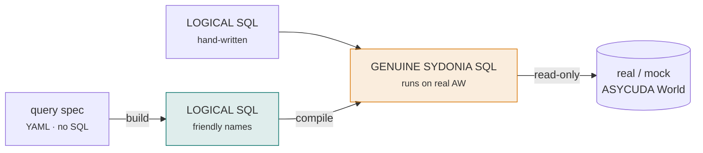

# The query compiler

**Write friendly, run genuine.** You write analytics queries against the
toolbox's clean [logical model](../schema/index.md) — `declaration`,
`declaration_item`, `tax_amount`, `hs_code` — and the compiler rewrites them into
**genuine ASYCUDA World SQL** that executes against the real, wide, denormalised
physical schema. The friendly names are the ergonomics; the compiled statement is
what a real SYDONIA instance would run.

!!! abstract "The pivot, in one line"
    This toolbox is no longer only a *reference model*. Its primary job is now to
    let you **query a real ASYCUDA World** — you write against the reconstruction,
    and the compiler turns that into runnable Sydonia SQL. The reconstruction
    became the **logical layer** the compiler maps *from*.

## The abstraction in one picture

```text
  query spec (no SQL)  ──build──►  LOGICAL SQL  ──compile──►  GENUINE SYDONIA SQL
   from / where / select            declaration,               SAD_General_Segment,
                                     tax_amount, hs_code        SAD_Tax.AMT, TAR_HSC…
```

Two entry points, one destination:



## Why an abstraction at all

A real ASYCUDA World database is **wide, denormalised, and mostly non-public**.
Writing analytics directly against it is painful, because:

| The real schema does this… | …so a raw query must |
|----------------------------|----------------------|
| Keys are engine `INSTANCE_ID` values | know the engine key convention |
| The general segment is repeated into **every item row** | `DISTINCT` the header itself |
| The HS code is split across `TAR_HSC_NB1..5` | concatenate five columns |
| Code **and** name are stored inline (`GEN_CAR_COD` + `GEN_CAR_NAM`) | fake a foreign key by code |
| `UN*` / `xx*TAB` reference rows carry `VALID_FROM` / `VALID_TO` | filter to currently-valid rows |
| Tax roots are `COD` / `BSE` / `RAT` / `AMT` / `MOP` on `SAD_Tax` | remember the terse field roots |

The logical model hides every one of these. You write
`di.hs_code`, `sum(tl.tax_amount)` and `d.selectivity_lane_id = 'RED'`; the
compiler bakes the gotchas into the output.

## How it works — the CTE prelude

The compiler scans your query for the **logical tables** it references, then
prepends each one as a **Common Table Expression** that `SELECT`s-and-aliases
from the real ASYCUDA World tables (per the [mapping](mapping.md)). Your query is
left **untouched** — the CTEs simply make the friendly names resolve to the real
schema. The result is **one standalone statement**, runnable anywhere, needing no
privilege to create views.

## Before and after

You write this friendly logical query:

```sql
SELECT di.hs_code, sum(tl.tax_amount) AS taxes
FROM declaration_item di
JOIN declaration_tax_line tl ON tl.declaration_item_id = di.id
GROUP BY di.hs_code;
```

`python -m compiler compile` turns it into this genuine Sydonia SQL — note the
`concat` of the split HS code and the `SAD_Tax` field roots, all injected by the
prelude while your `SELECT` stays exactly as written:

```sql
WITH
  declaration_item AS (
    SELECT
        i.INSTANCE_ID AS id,
        i.ITM_SGS_ID AS declaration_id,
        i.ITM_NBR AS item_number,
        concat(i.TAR_HSC_NB1, i.TAR_HSC_NB2, i.TAR_HSC_NB3, i.TAR_HSC_NB4, i.TAR_HSC_NB5) AS hs_code,
        i.VIT_CIF AS customs_value,
        i.VIT_STV AS statistical_value,
        i.ITM_NET_MAS AS net_mass,
        i.ITM_GRS_MAS AS gross_mass,
        i.ITM_ORG_COD AS country_origin_id,
        i.ITM_PKG_NBR AS number_of_packages
    FROM SAD_Item i
  ),
  declaration_tax_line AS (
    SELECT
        x.INSTANCE_ID AS id,
        x.TAX_ITM_ID AS declaration_item_id,
        x.COD AS tax_type_id,
        x.BSE AS tax_base,
        x.RAT AS rate_percent,
        x.AMT AS tax_amount,
        x.MOP AS mode_of_payment,
        (x.TYP = '1') AS is_manual
    FROM SAD_Tax x
  )
SELECT di.hs_code, sum(tl.tax_amount) AS taxes
FROM declaration_item di
JOIN declaration_tax_line tl ON tl.declaration_item_id = di.id
GROUP BY di.hs_code;
```

!!! success "The round-trip guarantee"
    The **same** logical query returns the **same** results whether run on the
    reconstruction sandbox (logical) or compiled and run on the mock physical
    database (genuine). See [Running the compiled SQL](running.md).

## Install

The compiler is pure standard library except for **PyYAML** (the mapping is
human-edited YAML):

```bash
pip install pyyaml
python -m compiler compile my_query.sql
```

## Where to go next

<div class="grid cards" markdown>

-   :material-code-braces:{ .lg .middle } &nbsp;**Write logical SQL**

    ---

    Author queries against the friendly names, `compile` them from a file or
    stdin, and see what the compiler detects and rewrites.

    [:octicons-arrow-right-24: Logical SQL & compile](logical-sql.md)

-   :material-form-select:{ .lg .middle } &nbsp;**Build without SQL**

    ---

    A tiny YAML query spec — `from` / `join` / `where` / `select` — that becomes
    logical SQL, then genuine Sydonia SQL.

    [:octicons-arrow-right-24: The query builder](builder.md)

-   :material-map:{ .lg .middle } &nbsp;**The mapping**

    ---

    How each logical table maps to its real AW source, per-instance overrides,
    and materialising persistent views with `emit-views`.

    [:octicons-arrow-right-24: The mapping](mapping.md)

-   :material-play-circle:{ .lg .middle } &nbsp;**Run it**

    ---

    The sandbox, the mock ASYCUDA World database (proving the round-trip), and a
    real instance — read-only.

    [:octicons-arrow-right-24: Running the SQL](running.md)

</div>

## Related

- [Querying Sydonia](../querying-sydonia/index.md) — the wider story of running
  against a real ASYCUDA World, and the [joins and gotchas](../querying-sydonia/joins-and-gotchas.md).
- [Querying the model](../guides/querying.md) and
  [useful queries](../guides/useful-queries.md) — the logical queries the compiler
  turns genuine.
- [Running on a real ASYCUDA World](../platform/running-on-real-asycuda.md) — the
  deployment, FDW and ETL detail behind the compiled SQL.

!!! note "Scope"
    The compiler targets read **analytics** queries (`SELECT` / `WITH`) — the
    project's use case. It is not a general SQL transpiler and deliberately does
    **not** handle writes or DDL.
