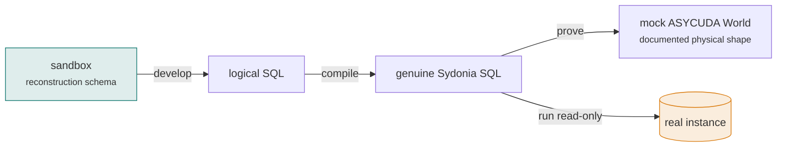

# Running the compiled SQL

The compiler produces one standalone genuine Sydonia statement. This page is
about **where you run it**. There are three targets, each with a different job:



| Target | Job | Runs |
|--------|-----|------|
| **Sandbox** | develop and verify logical queries | logical SQL |
| **Mock AW DB** | prove the compiled SQL actually runs and matches | genuine SQL |
| **Real instance** | run against your own declarations, read-only | genuine SQL |

## 1 · The reconstruction sandbox — develop logical queries

Load the toolbox's normalised `asycuda` schema as usual, and write **logical
SQL** against it directly. This is where you iterate — the friendly names, the
seeded [end-to-end example](../guides/worked-example.md), fast feedback:

```bash
createdb customs_sandbox
psql -v ON_ERROR_STOP=1 -d customs_sandbox -f Sydonia/schema/asycuda.sql
psql -v ON_ERROR_STOP=1 -d customs_sandbox -f Sydonia/schema/seed_reference.sql
psql -v ON_ERROR_STOP=1 -d customs_sandbox -f Sydonia/examples/e2e.sql
```

Everything in the [querying guide](../guides/querying.md) and the
[useful queries](../guides/useful-queries.md) library runs here. When a logical
query gives the answer you want, `compile` it for the targets below.

## 2 · The mock ASYCUDA World database — prove the round-trip

[`Sydonia/adapters/mock_asycuda_world.sql`](https://github.com/FrancoisChastel/sydonia-toolkit/blob/master/Sydonia/adapters/mock_asycuda_world.sql)
is a **mock ASYCUDA World physical database**: tables in the documented
wide/denormalised AW shape (`SAD_General_Segment`, `SAD_Item`, `SAD_Tax`, the
`UN*` reference tables), with the exact column names the default mapping targets,
seeded from the toolbox's end-to-end example reshaped into that physical shape.
It is the executable stand-in for a real deployment — no non-public instance
required.

```bash
createdb aw_mock
psql -v ON_ERROR_STOP=1 -d aw_mock -f Sydonia/adapters/mock_asycuda_world.sql

# compile a logical query and run the genuine SQL straight into the mock DB
python -m compiler compile my_query.sql \
  | psql -d aw_mock -c 'SET search_path TO aw, public;' -f -
```

!!! success "The round-trip guarantee (verified in CI)"
    The **same** logical query returns the **same** results whether run on the
    reconstruction sandbox (logical) or compiled and run on the mock physical
    database (genuine). Run the friendly query on the sandbox, `compile | psql`
    it into the mock, and compare — the numbers match. That is the proof the
    abstraction is faithful: **write friendly, run genuine.**

## 3 · A real ASYCUDA World instance — read-only

Two ways to run against a real deployment; both are read-only.

**Run compiled SQL directly.** Compile with your
[per-instance overrides](mapping.md) so the CTEs address the real physical names,
then run the output against the live database:

```bash
python -m compiler compile my_query.sql \
  --overrides compiler/mappings/myinstance.yml \
  | psql "$CUSTOMS_DB"
```

**Or load persistent views once.** Materialise the mapping as compatibility views
with [`emit-views`](mapping.md) and load them into the real database, so any tool
can address the friendly names without a compile step:

```bash
python -m compiler emit-views --overrides compiler/mappings/myinstance.yml \
  | psql "$CUSTOMS_DB"
```

Point **`CUSTOMS_DB`** at the real DSN (ideally a **`SELECT`-only role** on a
**read-replica**), and set `CUSTOMS_SCHEMA` to `asycuda` (or wherever you created
the views).

!!! note "Read-only via the tester — metadata only, never row data"
    Validate compiled SQL through the **customs-query-tester** MCP — driven by
    the [`customs-query`](../skills/index.md) skill, or the bundled
    `skills/customs-query/scripts/test_query.sh`. It returns column names/types,
    an aggregate row count and duration — and **never** row data — so it is safe
    against a database holding real customs declarations. The compiled SQL and the
    views are read-only by construction, so the privacy guarantees hold.

## Deployment, FDW and ETL

Pointing at a real instance raises questions this page doesn't: cross-dialect
deployments (Oracle / MS SQL Server / MySQL), foreign-data-wrapper front-ends
(`oracle_fdw` / `tds_fdw`), the `SELECT`-only role and read-replica setup, and the
**ETL-into-the-reference-model** alternative for bulk analytics and model
training.

All of that is covered in depth in
[**Running on a real ASYCUDA World**](../platform/running-on-real-asycuda.md) —
the compiler is the easiest path to *running the queries*; that page is the
deployment detail behind it.

## The recipes at a glance

| I want to… | Command |
|------------|---------|
| Develop a logical query | run it on the **sandbox** (`customs_sandbox`) |
| Prove the compiled SQL runs | `python -m compiler compile q.sql \| psql -d aw_mock -c 'SET search_path TO aw, public;' -f -` |
| Run against a real instance | `python -m compiler compile q.sql --overrides …myinstance.yml \| psql "$CUSTOMS_DB"` |
| Install persistent views once | `python -m compiler emit-views --overrides …myinstance.yml \| psql "$CUSTOMS_DB"` |
| Validate without reading rows | the [`customs-query`](../skills/index.md) skill / `test_query.sh` (metadata only) |

## Related

- [The mapping](mapping.md) — overrides and `emit-views`.
- [Writing logical SQL](logical-sql.md) — authoring and testing the queries.
- [Running on a real ASYCUDA World](../platform/running-on-real-asycuda.md) — the
  FDW / ETL / privacy deep dive.
- [Querying Sydonia](../querying-sydonia/index.md) ·
  [joins and gotchas](../querying-sydonia/joins-and-gotchas.md).
