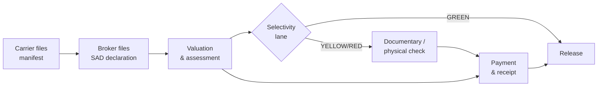
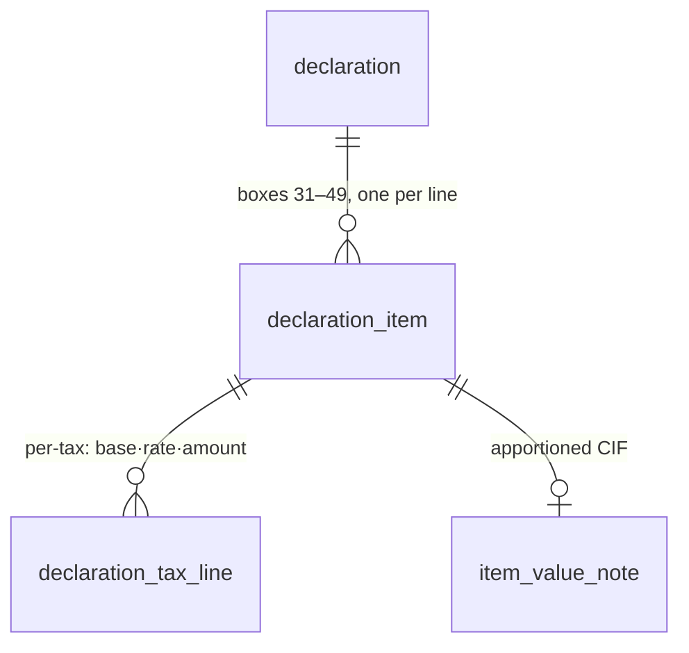
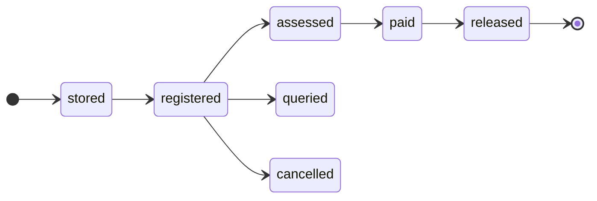

# Customs concepts

The schema reads like a story once you know the domain. This page is that story:
how goods move through customs, and which tables capture each step. Names in
`code font` are tables you can find in the [schema reference](../schema/index.md).

## The big picture



Two documents drive everything:

1. A **manifest** — what the *carrier* says is on board the ship/plane.
2. A **declaration (the SAD)** — what the *importer/broker* declares to customs,
   item by item, so duty and tax can be assessed and the goods released.

Everything else — valuation, taxes, selectivity, payment, warehousing — hangs
off those two.

## Reference / configuration backbone

Before any transaction exists, customs needs **code tables**: countries, currencies,
ports, tariff codes, tax types, procedure codes, package types, and so on. These
are the `ref_*` tables, grounded in international standards:

| Concept | Table | Standard |
|---------|-------|----------|
| Countries | `ref_country` | ISO 3166 |
| Currencies | `ref_currency` | ISO 4217 |
| Ports / places | `ref_location` | UN/LOCODE |
| Commodity codes | `ref_hs_tariff` | Harmonized System (self-referential hierarchy) |
| Procedure codes | `ref_cpc_regime` | Customs Procedure Codes |
| Package types | `ref_package_type` | UN/ECE Rec 21 |
| Container size-types | `ref_container_type` | ISO 6346 |
| Delivery terms | `ref_incoterm` | Incoterms |

Coded columns elsewhere carry a **foreign key** to one of these tables rather
than repeating the code and its name — see [Reference &
configuration](../schema/reference-config.md).

## Traders and users

An **economic operator** — importer, exporter, consignee, declarant, broker or
carrier — is a `trader`, keyed by its Tax Identification Number (TIN). One trader
can play several roles (`trader_role`). People who log into the system are
`sys_user` rows.

## Manifest and cargo

When a vessel arrives, the carrier lodges a **manifest** (`manifest`) — voyage,
ports, dates, and totals. Each consignment on board is a **bill of lading**
(`bill_of_lading`, or air waybill):

- A **master** B/L covers a whole container from carrier to carrier.
- A **house** B/L is one consignee's consignment inside it (**degroupage** /
  consolidation). The model captures this with a self-reference:
  `bill_of_lading.master_bl_id → bill_of_lading.id`.

Physical `container` rows (with ISO 6346 size-types and seals) and the goods
lines on each B/L (`manifest_cargo_item`) complete the cargo picture. See
[Manifest & cargo](../schema/manifest.md).

## The declaration — the SAD

The **Single Administrative Document (SAD)** is the internationally standardised
customs declaration form (54 boxes, 8 parts). ASYCUDA models it as two segments,
and so does this schema:

- A **general segment** — one per consignment — is the `declaration` table:
  parties, regime, transport, invoice totals, dates, status and selectivity lane.
- Repeating **item segments** are `declaration_item` rows: one per commodity
  line, with HS code, origin, mass, packages, procedure and the **statistical /
  customs value** that becomes the tax base.



See [Declaration (the SAD)](../schema/declaration.md).

## Valuation — how the tax base is built

Duty and tax are charged on the **customs value**, usually **CIF** (Cost,
Insurance, Freight). But an invoice is often FOB (goods only), with freight and
insurance quoted for the *whole* shipment. The **valuation note** builds the
value up and apportions the shared costs down to each item:

- `valuation_note` — declaration-level build-up:
  `invoice FOB + freight + insurance + other → total CIF`.
- `item_value_note` — the same costs **apportioned per item** (by value share)
  to produce each item's CIF, which is the tax base.

In the worked example, $3,000 freight + $300 insurance on a $60,000 FOB shipment
split 2:1 across the two items, giving item CIFs of $42,200 and $21,100.

## Taxes

Each item is taxed once per applicable **tax type** (import duty, VAT, excise,
fees). A `declaration_tax_line` records, for one item and one tax:

```text
tax_base · rate_percent (or specific_amount) · tax_amount · mode_of_payment
```

Taxes can cascade — VAT is often charged on *(customs value + import duty)* —
which is why the base is stored per line rather than derived. Totals are
computed by query, not stored (see the [querying guide](../guides/querying.md)).

## Selectivity — the risk lanes

Not every declaration is inspected. **Selectivity** routes each one into a lane:

| Lane | Meaning |
|------|---------|
| :material-circle:{ style="color:#16a34a" } **GREEN** | Automatic release |
| :material-circle:{ style="color:#ca8a04" } **YELLOW** | Documentary check |
| :material-circle:{ style="color:#dc2626" } **RED** | Physical examination |
| :material-circle:{ style="color:#2563eb" } **BLUE** | Released now, audited later |

`ref_selectivity_lane` defines the lanes, `risk_criterion` the rules that trigger
them, `selectivity_result` the lane a declaration landed in, and `inspection_act`
the officer's examination record. See [Selectivity & risk](../schema/selectivity.md).

## Accounting — payment and receipt

Once assessed, the declarant pays. `payment` records the settlement (cash or
against a deferred-payment `account`), `receipt` is the issued receipt, and
`account_movement` is the ledger entry. `guarantee` holds securities/bonds used
by suspense regimes. See [Accounting](../schema/accounting.md).

## Transit and suspense

Some goods are **not** cleared for home use immediately — duty is *suspended*:

- **Warehousing** — stored in a bonded `ref_warehouse` (`warehouse_entry` /
  `warehouse_exit`) until later entry.
- **Transit** — moved under customs control between offices
  (`transit_declaration`, with departure/transit/destination offices and a
  guarantee).
- **Temporary admission** — imported for a limited time then re-exported
  (`temporary_admission`).

See [Transit & suspense](../schema/transit-suspense.md).

## The document lifecycle

A declaration walks a fixed path, recorded in `declaration_status_history`:



Manifests have their own lifecycle (`manifest_status_history`), and every
significant action is written to the cross-cutting `audit_log`.

## Where to go next

- [Schema overview](../schema/index.md) — the 8 modules in one map.
- [Worked example](../guides/worked-example.md) — this whole story, as SQL.
- [Data dictionary](../schema/data-dictionary.md) — every column, defined.
