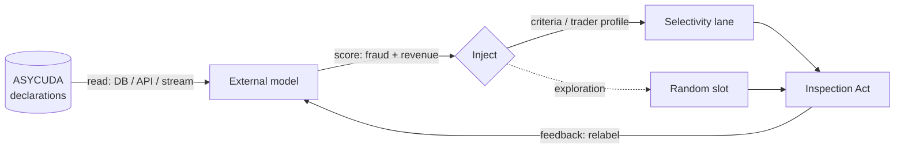

# ML on customs data

This toolbox was reconstructed with two payloads in mind: **(1)** doing
analytics / ML on customs declarations, and **(2)** plugging an external risk
engine into the clearance flow. This guide is the blueprint — distilled from the
public ASYCUDA record and public customs-ML research — and, crucially, a way to
**prototype the whole loop against this schema before you have access to a live
ASYCUDA system**.

!!! note "Read the platform behaviour first"
    This guide assumes the clearance state machine and four-lane routing from
    [Selectivity & clearance](../platform/selectivity-clearance.md). The lanes,
    the criterion model, and the **random exploration slot** are the hooks
    everything here plugs into.

## The canonical loop

Every documented ASYCUDA-plus-ML deployment follows the same four-step loop:
**read → score → inject → feedback**.



The pattern is proven at several levels of evidence:

- **Vendor risk-management plugins** on legacy AW — the real-world blueprint.
  A typical plugin ingests ASYCUDA data *through either a database connection or
  an API*, trains and scores externally, pushes high-risk flags back into
  selectivity, and feeds inspection outcomes back in real time to retrain.
- **Live production deployments** — the deployable analogue. A separate but
  integrated risk module within ASYCUDA World retrieves the declaration in real
  time on submission, scores it (nomenclature, origin, importer/exporter history,
  declaration patterns, valuation anomalies), and sends risk recommendations back
  to officers through ASYCUDA World. This proves the architecture is deployable
  **today**.
- **ASY5 first-class hook** — the new generation transforms *"signals from ML
  analysis of customs data or from third-party AI engines … into clear risk
  profiles"* via a **Risk Configuration → Signal Transformation → Risk Output**
  pipeline. The intended injection point once a country is on ASY5 — but the
  **payload format is not yet public**.

## The feature set

The empirically-standard feature schema used across public customs-ML research
maps directly onto ASYCUDA fields and onto our tables. The fourth column is what
you query in the [`asycuda`](../schema/data-dictionary.md) schema:

| Concept | SAD box | AW XML tag | Sydonia Toolkit column |
|---------|:-------:|------------|-----------------------------|
| Declaration ID | 7 | `Declarant/Reference/Number` | `declaration.id` (business ref: `declaration.trader_reference`) |
| Date | reg. | `Identification/Registration/Date` | `declaration.registration_date` |
| Importer TIN | 8 | `Consignee_code` | `trader.tin` via `declaration.consignee_id` |
| Declarant / broker | 14 | `Declarant_code` | `trader.tin` via `declaration.declarant_id` |
| Origin | 34a | `Country_of_origin_code` | `declaration_item.country_origin_id` → `ref_country` |
| Office / port | A/29 | `Customs_clearance_office_code` | `declaration.office_id` → `ref_customs_office` |
| HS / tariff | 33 | `Commodity_code` | `declaration_item.hs_code` |
| Quantity | 41 | `Supplementary_unit_quantity` | `declaration_item.supplementary_qty` |
| Gross weight | 35 | `Gross_weight_itm` | `declaration_item.gross_mass` |
| Invoice value (FOB) | 22/42 | `Invoice/Amount_foreign_currency` | `declaration_item.item_price` (hdr `declaration.total_invoice_amount`) |
| Customs value (CIF) | 46 | `Statistical_value` | `declaration_item.customs_value` |
| Total taxes | 47 | `Item_taxes_amount` / `Global_taxes` | `sum(declaration_tax_line.tax_amount)` |
| **Label** — illicit (0/1) | inspection | (server outcome) | `inspection_act.result` |
| **Target** — revenue | inspection | (server outcome) | `inspection_act.findings` (free text; not a structured amount) |

**Engineered signals** the literature relies on: unit price (`cif / quantity`),
weight-unit price (`cif / gross_mass`), tax ratio (`total_taxes / cif`),
FOB/CIF ratio, cross-features (**HS6 × origin**, office × importer), and
mean-target risk encodings per importer / HS / office.

## Labels & bias

The single hardest problem is not features — it is **labels**.

- **Labels only exist for inspected declarations.** `illicit` / `revenue` are
  recorded only for Yellow/Red (and PCA) declarations; green-lane transactions
  are unlabelled. This is **selection bias** baked into your training set.
- **The Inspection Act is the feedback signal** — in our model,
  `inspection_act.result` (conform / discrepancy) and `inspection_act.findings`.
  Read it back to relabel and retrain.
- **Exploration mitigates the bias.** The **random slot** (the 1–3% green→red
  re-route) is your uniform sample of the unlabelled space — reserve it for
  exploration rather than exploitation.
- **The field uses semi-supervised + active-learning methods** (e.g. GraphFC)
  precisely because of this bias: inspected items get relabelled and added to
  training (active learning), and unlabelled structure is exploited
  semi-supervised.

## Prototype on this toolbox

You can build and test the entire read → feature → label loop against this
schema before touching a live system.

**1. Stand up the schema.** Use the
[`customs-schema-setup`](../skills/index.md) skill to load the `asycuda` schema,
then [`customs-seed`](../skills/index.md) to generate synthetic manifests,
declarations, items, tax lines and inspection acts. Set the search path once:

```sql
SET search_path TO asycuda, public;
```

**2. Extract a per-item feature vector.** One row per declared item, with the
engineered ratios computed in-query:

```sql
SELECT d.id                              AS declaration_id,
       d.registration_date               AS decl_date,
       imp.tin                           AS importer_tin,
       org.iso_alpha2                    AS origin,
       off.office_code                   AS office,
       di.hs_code,
       left(di.hs_code, 6)               AS hs6,
       di.gross_mass,
       di.customs_value                  AS cif,
       coalesce(sum(tl.tax_amount), 0)   AS total_taxes,
       di.customs_value / nullif(di.gross_mass, 0)          AS unit_price_per_kg,
       coalesce(sum(tl.tax_amount), 0)
           / nullif(di.customs_value, 0)                    AS tax_ratio
FROM declaration_item di
JOIN declaration d          ON d.id  = di.declaration_id
JOIN trader imp             ON imp.id = d.consignee_id
LEFT JOIN ref_country org   ON org.id = di.country_origin_id
JOIN ref_customs_office off ON off.id = d.office_id
LEFT JOIN declaration_tax_line tl ON tl.declaration_item_id = di.id
GROUP BY d.id, d.registration_date, imp.tin, org.iso_alpha2, off.office_code,
         di.hs_code, di.gross_mass, di.customs_value;
```

**3. Pull the labels.** Only inspected declarations have them — the join is a
`LEFT JOIN`, and the `NULL` rows *are* the selection bias:

```sql
SELECT d.id AS declaration_id,
       lane.code AS lane,
       ia.result,
       ia.findings,
       CASE WHEN ia.result = 'discrepancy' THEN 1
            WHEN ia.result = 'conform'     THEN 0
            ELSE NULL END AS illicit_label
FROM declaration d
JOIN ref_selectivity_lane lane ON lane.id = d.selectivity_lane_id
LEFT JOIN inspection_act ia    ON ia.declaration_id = d.id;
```

**4. Aggregate a per-importer risk encoding.** A mean-target feature — the kind
the literature leans on hardest:

```sql
SELECT imp.tin                                             AS importer_tin,
       count(*)                                            AS inspected,
       count(*) FILTER (WHERE ia.result = 'discrepancy')   AS discrepancies,
       round(100.0 * count(*) FILTER (WHERE ia.result = 'discrepancy')
             / nullif(count(*), 0), 1)                     AS discrepancy_rate
FROM declaration d
JOIN trader imp          ON imp.id = d.consignee_id
JOIN inspection_act ia   ON ia.declaration_id = d.id
GROUP BY imp.tin
ORDER BY discrepancy_rate DESC NULLS LAST;
```

Adapt the join-path style from [Querying the model](querying.md); every column
above is verified against the schema.

!!! tip "External baselines to prototype against"
    Before you have real ASYCUDA history, train against **public customs-ML
    research and open customs datasets**. The field offers:

    - **Open, downloadable customs declaration datasets** — some synthetic, with
      fraud / critical-fraud labels — good enough to prototype the feature
      pipeline and modelling against before you have real history.
    - **Published dual-task scorers** that predict both illicitness and
      recoverable revenue, reporting high precision and revenue recall while
      inspecting only a small fraction of flows — a well-documented target to
      benchmark against.
    - **Reference open-source analytics notebooks** for customs fraud detection —
      the standard starting point for feature engineering and baselines.

## Going live

Once you move from this sandbox to a real deployment, the four-step reference
architecture:

1. **Read** — a **DB read-replica** of the ASYCUDA schema for training data
   (the proven path for vendor risk plugins), plus **ASYHUB** API / **Cargo-XML**
   pre-arrival feed or **Kafka** (ASY5) for real-time scoring.
2. **Score** — output a per-declaration fraud/illicitness score **and** predicted
   recoverable revenue (a dual-task scorer).
3. **Inject** — on legacy AW, write into selectivity criteria / trader profiles,
   prioritising the **random / exploration slot**; on ASY5, emit "signals".
4. **Feedback** — read **Inspection Act / PCA** outcomes to relabel and retrain.

!!! warning "The deadline is set by when selectivity fires"
    Whether selectivity fires **before or after assessment** is a per-country
    switch (see
    [the timing warning](../platform/selectivity-clearance.md#when-selectivity-fires-the-timing-switch)).
    It sets the hard deadline by which your engine must have scored the
    declaration. Confirm the mode before committing to real-time.

!!! note "What to request — these are not public"
    No public customs-ML dataset or research codebase ships an ASYCUDA connector;
    the ETL and write-back are bespoke in every deployment. Before building,
    request from your national customs administration or the UNCTAD ASYCUDA
    programme: the **physical DB schema**, the **ASYHUB API spec**, the **ASY5
    risk-signal payload format**, the **Asysel** admin data model, and
    **Inspection-Act read access** (illicit flag + recovered revenue). See
    [Integration surfaces](../platform/integration.md) for the doors and the
    request list.
