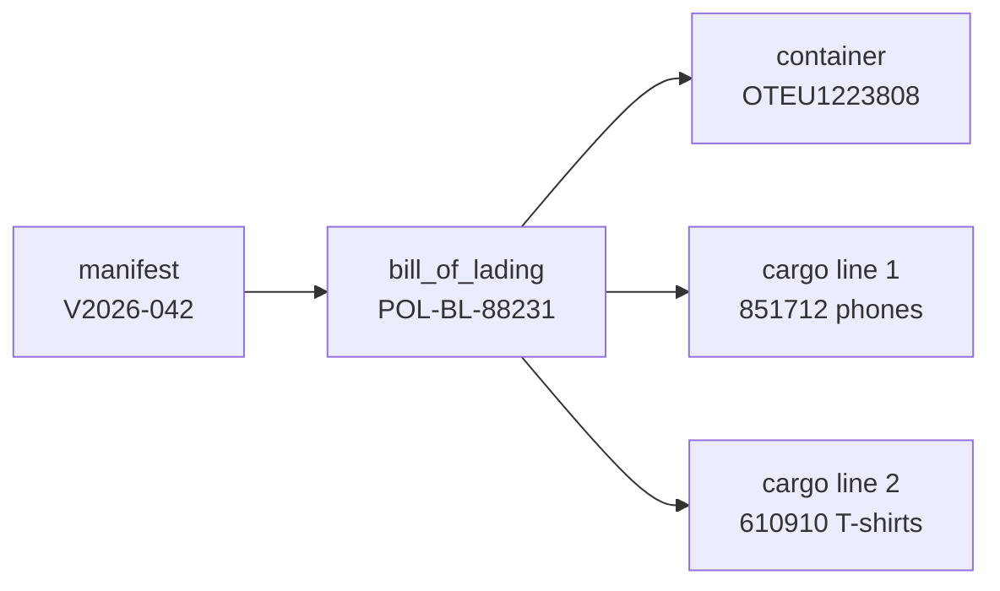

# Worked example — manifest to release

`Sydonia/examples/e2e.sql` inserts one complete import and prints it back. This
page narrates that script so you can see the domain and the schema working
together. The scenario: **consumer electronics and apparel shipped from Shanghai
to Pohnpei (FSM)**, cleared by a broker.

Load it (after the schema and seed):

```bash
psql -v ON_ERROR_STOP=1 -d customs_sandbox -f Sydonia/examples/e2e.sql
```

The whole script runs in **one transaction** and uses natural-key subselects
(`SELECT id FROM … WHERE code = …`) so it is order-independent and self-documenting.

## 0 · Parties

Five economic operators — carrier, shipping agent, exporter, importer/consignee
and broker — plus two system users (the broker and a customs officer).

```sql
INSERT INTO trader (tin, name, address, country_id) VALUES
    ('EXP001','Shenzhen Electronics Co', 'Shenzhen, China', (SELECT id FROM ref_country WHERE iso_alpha2='CN')),
    ('IMP001','Pohnpei Trading Ltd',     'Kolonia, Pohnpei',(SELECT id FROM ref_country WHERE iso_alpha2='FM')),
    ...;
```

## 1 · Manifest

The carrier's manifest: **MV Pacific Star**, voyage V2026-042, Shanghai →
Pohnpei, one bill of lading, one container, 250 packages. A house B/L
(`POL-BL-88231`, nature *Imports*) carries two goods lines — phones and T-shirts
— stuffed in container `OTEU1223808`.



## 2 · Declaration

The broker files an **IM4** (import for home use) declaration, regime `4000`,
against the manifest. Two items:

| Item | HS | Goods | FOB |
|:----:|----|-------|----:|
| 1 | 851712 | Mobile telephones | $40,000 |
| 2 | 610910 | Cotton T-shirts | $20,000 |

Invoice terms are **CIF**, currency USD, total FOB $60,000, freight $3,000,
insurance $300 → total CIF **$63,300**.

## 3 · Valuation note

Freight and insurance are apportioned to each item by FOB share (2:1):

| Item | FOB | + freight | + insurance | = item CIF |
|:----:|----:|----------:|------------:|-----------:|
| 1 | 40,000 | 2,000 | 200 | **42,200** |
| 2 | 20,000 | 1,000 | 100 | **21,100** |

Those item CIFs become the **customs value** — the tax base.

## 4 · Tax lines

Duty and VAT per item. Note VAT cascades — its base is *(customs value + import
duty)*:

| Item | Tax | Base | Rate | Amount |
|:----:|-----|-----:|:----:|-------:|
| 1 | IMP | 42,200 | 5% | 2,110.00 |
| 1 | VAT | 44,310 | 10% | 4,431.00 |
| 2 | IMP | 21,100 | 15% | 3,165.00 |
| 2 | VAT | 24,265 | 10% | 2,426.50 |

**Total assessed: $12,132.50.**

## 5 · Documents

An attached commercial invoice (`380`) and bill of lading (`705`), then each item
is **written off** against the manifest B/L via `declaration_previous_document`
(SAD box 40) — closing the loop between what the carrier manifested and what the
importer declared.

## 6 · Lifecycle, selectivity, payment, release

The declaration walks its lifecycle, is routed **RED** by the `HS-HIGHRISK`
criterion (electronics chapter), inspected and found conform, paid ($12,132.50,
receipt `RCPT-2026-0427`), and released:


An `audit_log` row records the release.

## The verification read-out

After `COMMIT`, the script prints four checks:

```text
--- Declaration summary ---
  reg  | type |  status  | lane | total_items | total_cif_value
-------+------+----------+------+-------------+-----------------
 C 427 | IM4  | released | RED  |           2 |      63300.0000

--- Items with tax totals ---
 item_number | hs_code | customs_value |   taxes
-------------+---------+---------------+-----------
           1 | 851712  |    42200.0000 | 6541.0000
           2 | 610910  |    21100.0000 | 5591.5000

--- Total assessed vs receipt ---
 total_assessed | receipt_amount
----------------+----------------
     12132.5000 |     12132.5000

--- Lifecycle trail ---
 sort_order |    code    |                note
------------+------------+-------------------------------------
          1 | stored     | Draft captured
          2 | registered | Validated & registered (C 427)
          3 | assessed   | Assessed: duties & taxes calculated
          4 | paid       | Paid — receipt RCPT-2026-0427
          5 | released   | Release order issued
```

`total_assessed = receipt_amount` and every foreign key resolves — the model is
internally consistent end to end.

## Try changing it

- Add a **third item** and watch the apportionment and totals shift.
- Route it **GREEN** instead and drop the `inspection_act`.
- Pay against a deferred **`account`** instead of cash, and add the
  `account_movement`.

The [querying guide](querying.md) has the reports to see your changes; the
[extending guide](extending.md) shows how to add new structure.
