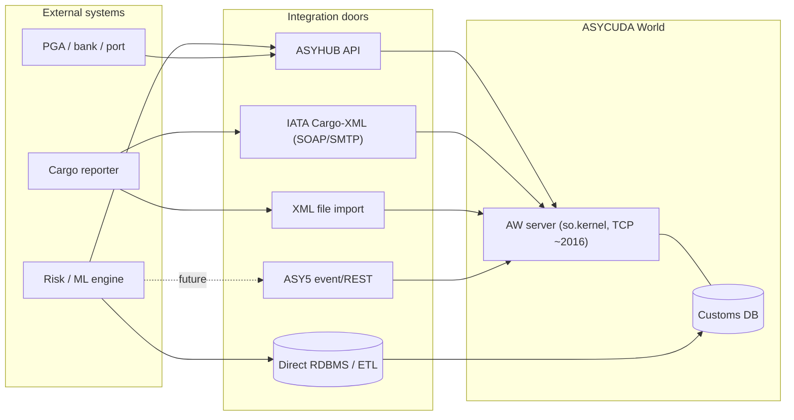

# Integration surfaces

There is **no public REST API**, **no single master WSDL**, and the thick-client
protocol is closed. And yet ASYCUDA World is integrated with banks, port
community systems, partner-government agencies and external risk engines every
day — through four or five real doors, not the front one. This page maps those
doors, the gaps you must formally request, and how this reconstruction stands in
for the biggest gap of all.

!!! warning "Do not integrate at the client protocol"
    The AW desktop client is a **Java Web Start thick client**
    (`ASYCUDAWorld.jnlp`, ~130 JARs over HTTPS, main class
    **`so.kernel.client.DesktopMain`**) that connects to the server on a **custom
    TCP port** (e.g. `//host:2016/`) with a **proprietary object/XML protocol —
    NOT SOAP or REST**. The `so.kernel.*` / `so.util.*` namespace is UNCTAD's
    internal kernel; this channel is effectively closed to third parties. **Do
    not build an integration by speaking the client protocol.**

## The integration doors (ranked by how documented/proven they are)

| Surface | What it is | Fit |
|---------|------------|-----|
| **Direct RDBMS / ETL** | AW stores everything in Oracle/MSSQL/MySQL/PostgreSQL. BI and warehouses pull via SQL / replication / ETL against a read-replica. | **Best for training-data extraction** — but the schema is not public (needs DBA + schema discovery). |
| **ASYHUB** | UNCTAD's open, cloud-native, microservice data hub: *"provides an API for authorized entities to access customs data and documents,"* supports pre-arrival risk analysis, extendable connectors, ETL + monitoring dashboard. Aligned to WCO DM v3.8.1. | **Best sanctioned real-time path** — the intended external-integration door. API spec not public (request it). |
| **IATA Cargo-XML (SOAP/SMTP)** | Machine interface for air-cargo manifests (XFFM/XFWB/XFZB → XFNM), per-filer login/password, per-country endpoints. | Viable **pre-arrival cargo feed**; endpoints are credential-gated. |
| **XML file import** | External systems generate conformant `<ASYCUDA>` XML, loaded via the client's *Import XML File*. Some integrators UI-automate the client. | Declaration in/out **without a DB** — but not a real-time API. |
| **ASY5 event/REST** | New-generation microservices expose Kafka topics + REST; the risk pipeline ingests external "signals." | **Friendliest** once the target is on ASY5 (Angola only, Jan 2026); specs not yet public. |

!!! note "DTI is not an API"
    **Direct Trader Input (DTI)** — prepare/validate/print/submit a SAD and get a
    registration/acceptance reference — is a **UI capability of the thick
    client**, not a REST endpoint. Programmatic declaration submission goes
    through the XML file path (SAD XML) or the SOAP services, not DTI. AW also
    ships **built-in reporting / Business-Intelligence alerts** — useful for
    aggregates, less so for row-level training data.

## Architecture at a glance

## Where this toolbox fits

The single most important non-public gap is the **physical DB schema** — the one
thing you need to design an ETL job, a warehouse target, an integration test, or
the shape of your training data *before* you get real access.

**This reconstruction is the public stand-in for that gap.** 55 tables in the
[`asycuda`](../schema/index.md) schema, provenance-tagged against the public XML
and manuals, let you:

- Design ETL and warehouse targets against a concrete, credible column model
  instead of guessing — then remap to the real schema once a DBA hands it over.
- Build and run integration tests against realistic data before you have a
  sandbox: [load the schema](../guides/loading.md) into any Postgres.
- Prototype training-data shapes and feature pipelines against the same fields
  the real system exposes.

The [skills](../skills/index.md) (`customs-query`, `customs-seed`,
`customs-extend`) drive exactly this: query, populate and adapt the model to your
deployment's quirks before you connect anything real.

## What you must request

None of the following is publicly documented. Request from your national customs
administration or UNCTAD:

1. **Physical DB schema / ERD** — the biggest gap for both training-data
   extraction and write-back.
2. **ASYHUB API specification** (OpenAPI/WSDL, auth, message catalog) — the
   single most important unknown for sanctioned real-time integration.
3. **ASY5 "third-party AI → risk profile" signal payload format & endpoint.**
4. **Asysel admin data model** — criterion operators, priority, validity, AND/OR
   syntax, score→lane thresholds (deliberately hidden to prevent gaming).
5. **The exact selectivity-injection write-path** (criteria table? trader
   profile? signal table? DB trigger?).
6. **Tax-rules "customs taxation language"** grammar + the national code lists
   (tariff, tax-type, CPC/ANC, exemptions, offices, currencies).
7. **Inspection-Act read access** (illicit flag + recovered revenue) — required
   for ML labels and the feedback loop.

**Channels to obtain restricted docs:** `ASYCUDA@UNCTAD.org` · your national
customs ASYCUDA project team · `elearning.asycuda.org` (blended-learning
enrolment) · `gitlab.asycuda.org` (credentialed).

!!! tip "Confirm these three before building"
    - Which **generation** — ASYCUDA++, World, or ASY5? (ASY5/ASYHUB are far
      friendlier.)
    - **When does selectivity fire** — before or after assessment?
    - **Real-time vs batch** scoring, and **pre-arrival vs at-assessment**?

## Bespoke integrations (no published spec)

**Single Window** connects traders ↔ customs ↔ partner-government agencies for
LPCO admissibility documents via WCO-DM XML (eCITES for endangered-species
permits is a concrete example). **e-Payment** generates a reference number, the
trader pays 24×7, and success is posted back to ASYCUDA in real time — bespoke
per bank and country. **NII/scanner** and **port-community** integrations exist
in deployments but carry no published, standardized interface spec.

## Related

- [Selectivity & clearance](selectivity-clearance.md) — the lane model and where
  a risk score is injected.
- [The ML risk engine path](../guides/ml-risk-engine.md) — reading, scoring,
  injecting and feeding back.
- [XML messages & the wire format](xml-messages.md) — the file-import door in
  detail.
- [Resources & documents](resources.md) — where the public and restricted specs
  live.
