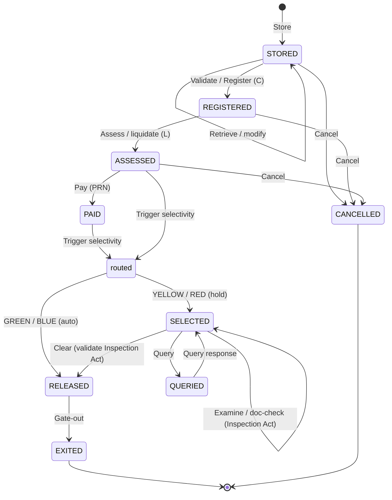

# Selectivity & clearance

This page describes how a declaration actually **moves through ASYCUDA World**:
the clearance **state machine** and the **four-lane risk routing** performed by
the selectivity module (internally **"Asysel"**). It is the platform behaviour.
For *our* tables — `ref_selectivity_lane`, `risk_criterion`,
`selectivity_result`, `inspection_act` — see
[Selectivity & risk](../schema/selectivity.md) in the schema section.

!!! note "Where these facts come from"
    The lane model and criterion structure are grounded in UNCTAD's ASYCUDA
    newsletters (Aug 2019, Sept 2021) and national brokers' manuals `[A/B]`; the
    status model comes chiefly from the Uganda URA *Declaration Processing*
    manual `[A/B]`. The **Asysel admin data model** (operators, priorities,
    score→lane thresholds) is deliberately **not public** — kept hidden to
    prevent gaming. Everything below is reconstructed from the public layer.

## The clearance state machine

The central object is the **SAD** (the declaration). It moves through a fixed
lifecycle, colour-coded in the ASYCUDA "Finder". Three statuses stamp a
reference with a serial prefix — the fingerprints you see on paperwork:

| Status | Reference prefix | Meaning |
|--------|:---------------:|---------|
| **STORED** | — | Captured, freely amendable before assessment |
| **REGISTERED** | **C** | Legal status + Customs Reference No. assigned |
| **ASSESSED** (liquidated) | **L** | Duties computed; amendments locked |
| **PAID** | **PRN** | ASYCUDA receipt issued (Payment Reference No.) |
| **SELECTED** | — | Red/Yellow held pending checks |
| **QUERIED** | — | Officer raises a question in the Inspection Act; broker responds |
| **RELEASED** | — | Checks done → Release Order (automatic for Green/Blue) |
| **EXITED** | — | Goods gate-out |
| **CANCELLED** | — | Assessment voided (supports refund) |

The French vocabulary you will meet in SYDONIA installs runs in parallel:
*saisie → stockée → enregistrée → liquidée → acquittée → circuit → mainlevée /
BAE → sortie*. **AMENDED / RECTIFIED** is an event (retrieve + modify), not a
terminal state.

## The four lanes

Selectivity routes every declaration — **typically after assessment/payment** —
into one of four lanes, configured nationally by the Customs Risk Management
Unit. Legacy ASYCUDA++/SYDONIA had only three circuits (green/yellow/red);
**BLUE is an ASYCUDA World addition**.

| Lane | Requires exam | Meaning |
|------|:-------------:|---------|
| :material-circle:{ style="color:#16a34a" } **GREEN** | no | Auto-release; customs still reserves the right to examine |
| :material-circle:{ style="color:#ca8a04" } **YELLOW** | yes | Documentary check only |
| :material-circle:{ style="color:#dc2626" } **RED** | yes | Documentary check + physical examination; examiner completes the **Inspection Act** |
| :material-circle:{ style="color:#2563eb" } **BLUE** | no | Released now, **Post-Clearance Audit** verifies later |

Risk tiers commonly map Green (lowest) → Blue (low) → Yellow (medium) → Red
(high).

## The criteria model

A **criterion** is *"an instruction to control the content of some fields of the
declaration"* — a condition on fields mapped to a control channel (lane). Two
things make it powerful for ML integration:

- **Two-level scoring.** Criteria fire at **declaration level** *and* at
  **trader level** — a profile keyed to the importer **TIN**. A strong trader
  profile can override a declaration-level flag; AEOs go to Red only by
  mandatory low-rate random selection.
- **Any element is usable.** *"All the data elements of the declaration and of
  the B/L are usable by the selectivity"* — HS/tariff code, origin, importer /
  exporter / declarant TINs, office, declared value versus a reference-price DB,
  Incoterms, currency, goods description, Box 44 permit references, CPC, any
  manifest / bill-of-lading field. This is what extends control to pre-arrival.

Two scoring generations coexist. **(A) Classic rule-based** — per-criterion
weights configured nationally (Mali: importer / origin / tariff each classed
low/med/high by fraud rate → Red if ≥1 high or ≥2 medium; Yellow if 1 medium;
else Green). **(B) ML "Dynamic Selectivity"** (AW v4.4+, ~2021) — UNCTAD's
**native** ML component that *"assigns a score and the degree of inspection"*
from declarant / importer / origin, self-updating from inspection feedback.

!!! tip "The random slot is the injection point"
    A distinct **random selectivity** layer re-routes a percentage of green
    declarations to red — best-documented value **1–3%** (Mali) — so procedures
    stay unpredictable. A separate random function even assigns *which officer*
    verifies (anti-collusion). **This random slot is the natural injection point
    for an ML "exploration" strategy** — the exploitation/exploration split that
    the [ML risk-engine guide](../guides/ml-risk-engine.md) builds on.

## When selectivity fires — the timing switch

!!! warning "This sets your ML scoring deadline"
    *When* selectivity fires is a **per-country switch**. Documented African and
    Caribbean deployments run selectivity **after assessment/payment**; ASYCUDA
    also supports **selectivity before assessment**. Your integration must know
    which mode the target runs — it changes the deadline by which your ML engine
    must have scored the declaration. Confirm this before building anything
    real-time. See the [ML risk-engine guide](../guides/ml-risk-engine.md#going-live).

## Mapping the platform to our model

Our schema represents most — but not all — of this behaviour. The honest map:

| Platform concept | Our model | Notes |
|------------------|-----------|-------|
| Status lifecycle (STORED…RELEASED) | `ref_declaration_status` rows; current on `declaration.status_id` | Statuses we store: **stored / registered / assessed / paid / released / queried / cancelled** |
| Status transitions over time | `declaration_status_history` (`status_id`, `changed_at`, `changed_by`) | The full audit trail of the state machine |
| The four lanes | `ref_selectivity_lane` (`code`, `requires_exam`) | Green / Yellow / Red / Blue |
| A criterion → target lane | `risk_criterion` (`code`, `name`, `target_lane_id`) | Criterion *operators / priorities / weights* are **not modelled** — they are not public |
| The lane a declaration was routed to, and why | `selectivity_result` (`lane_id`, `criterion_id`, `triggered_at`, `officer_id`); current lane cached on `declaration.selectivity_lane_id` | Preserves the routing history and reason |
| Examiner's outcome (the ML label) | `inspection_act` (`result`, `findings`, `inspected_at`, `officer_id`) | The feedback signal for the learning loop |
| Payment / receipt (PRN) | `payment`, `receipt` | The PAID transition |

### Two honest gaps

The research's state machine has two states our status catalogue does **not**
carry as `ref_declaration_status` rows:

!!! warning "SELECTED and EXITED are not statuses in our model"
    - **SELECTED** — the "held pending checks" state — has **no direct status
      row**. It *is* representable indirectly: a row in `selectivity_result`
      routing the declaration to Yellow/Red, plus (optionally) an
      `inspection_act`, expresses "this declaration was selected". The
      declaration's own `status_id` stays at its last true status
      (e.g. `paid`) until it moves to `released`.
    - **EXITED** — the physical **gate-out** — is **not modelled at all**. Our
      lifecycle ends at `released`; there is no exit / gate event table and no
      `exited` status. If you need to model goods leaving the premises, you must
      [extend the schema](../guides/extending.md) yourself.

    State these gaps plainly in any analysis — do not treat a `released`
    declaration as evidence the goods have physically exited.

## Next

-   :material-robot-outline:{ .lg .middle } &nbsp;**Build the loop**

    ---

    Turn this behaviour into a working risk engine — features, labels, the
    read → score → inject → feedback loop, and how to prototype on this schema.

    [:octicons-arrow-right-24: ML on customs data](../guides/ml-risk-engine.md)

-   :material-connection:{ .lg .middle } &nbsp;**The doors**

    ---

    Where an external engine actually plugs in — RDBMS/ETL, ASYHUB,
    Cargo-XML, ASY5 — and the specs you must request.

    [:octicons-arrow-right-24: Integration surfaces](integration.md)

