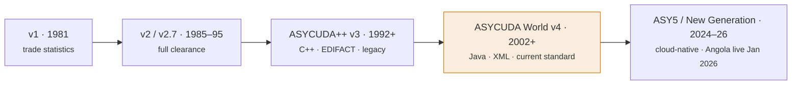

# Version lineage

ASYCUDA is one system with three names and five generations. The name localises
by language — **ASYCUDA** (EN) = **SYDONIA** (FR) = **SIDUNEA** (ES) — but the
software family is the same. UNCTAD has shipped it since 1981, and every country
that runs it runs one of these generations.

Version matters because it changes two things you actually care about: the
**data model** (how a declaration is stored and structured) and the
**integration surfaces** (how, or whether, you can read and write data from
outside). A tool built for ASYCUDA World's XML e-documents does not map onto
ASYCUDA++'s EDIFACT-and-Oracle world, and neither maps onto the cloud-native
microservices of the new generation. Identify the generation before you assume
anything about the schema.

## The five generations

ASYCUDA World (v4) is the current standard — around **90%** of the 100+ using
countries and territories are on it or migrating to it. ASYCUDA++ is legacy but
still live in a few countries mid-migration; the new generation ("ASY5") is in
phased rollout, with **Angola live since January 2026**.

## Comparison across generations

| Version | Era | Tech stack | Database | Architecture | Data model | Who runs it |
|---|---|---|---|---|---|---|
| **v1** | 1981–84 | DOS-era micro | Flat files | Standalone micro | Trade-statistics capture | First ECOWAS countries — statistics only |
| **v2 / v2.7** | 1985–95 | C, DOS/UNIX | Flat-file / Informix | LAN client + file server | Full clearance | Many developing countries in the 1990s; some legacy holdouts |
| **ASYCUDA++ (v3)** | 1992–present (legacy) | **C++**, UN/EDIFACT | **Oracle / Informix / Sybase** | Thick client-server | Relational; EDIFACT (CUSDEC); MODSEL selectivity | Rolled out late-90s–2000s; a few countries still live, mid-migration |
| **ASYCUDA World (v4)** | 2002–present (**current standard**) | **100% Java**, XML documents, Java Web Start client | Oracle, MS SQL Server, MySQL, PostgreSQL, DB2, Sybase, Informix | Web / store-and-forward, N-tier | **XML e-document model**; SAD = general segment + item segments | 100+ countries/territories; ~90% on or migrating to it |
| **ASY5 / New Generation** | 2024–26 (Angola live Jan 2026) | Cloud-native microservices: **Quarkus, Kubernetes, Kafka, Keycloak, VueJS**; open-source | Cloud data platform | Modular microservices, REST / event | Data-driven, WCO-DM aligned; native + third-party AI risk | Phased rollout; Angola first |

## How to tell which version you have

The three current generations leave distinct fingerprints. If you know the
client and the wire format, you know the version.

-   :material-language-java:{ .lg .middle } **ASYCUDA World (v4)**

    ---

    100% Java. The client is a **Java Web Start thick client** — a `.jnlp`
    launch file pulling ~130 JARs over HTTPS, main class
    `so.kernel.client.DesktopMain`, connecting to the server on a custom TCP
    port (e.g. `//host:2016/`). Business data moves as **non-namespaced XML
    e-documents**. If you see a JNLP launcher and XML exports, it is v4.

-   :material-language-cpp:{ .lg .middle } **ASYCUDA++ (v3)**

    ---

    A **C++ thick client** in a client-server deployment, backed by a relational
    **Oracle / Informix / Sybase** database. Data exchange is **UN/EDIFACT** —
    the `CUSDEC` message is the declaration. Selectivity runs through the MODSEL
    module. No XML e-documents, no Java client.

-   :material-cloud-outline:{ .lg .middle } **ASY5 / New Generation**

    ---

    **Cloud-native microservices** — Quarkus, Kubernetes, Kafka, Keycloak, a
    VueJS front end — and open-source. Integration is REST and event-based
    (Kafka topics), with a first-class hook for native and third-party AI risk
    signals. In phased rollout; Angola went live in January 2026.

## Modules

Across ASYCUDA World and the new generation, functional modules extend the core
clearance system:

- **ASYHUB** — external-system data hub (an API for authorised entities).
- **ASYFCI** — Fast Cargo Integration (the cargo-manifest / AWMDS handler).
- **ASYADN** — advance data (pre-arrival manifest information).
- **ASYREC** — relief consignments (humanitarian).
- **eCITES** — endangered-species trade permits.
- **ASYCUDA Single Window** — connects partner government agencies for licences,
  permits and certificates.

## An accuracy caveat

Not every developing country runs ASYCUDA. Region is not a reliable signal:
**Senegal never adopted SYDONIA** — it built its own **GAINDE** system — and some
countries run other platforms entirely. Confirm the target administration before
you assume it is on ASYCUDA at all.

!!! note "This toolbox models ASYCUDA World (v4)"

    The Sydonia Toolkit reconstructs the data model of **ASYCUDA World
    (v4)** specifically — the current standard, and the version whose field-level
    model is public through its XML layer and national manuals. It does **not**
    model the ASYCUDA++ relational schema or the ASY5 microservice data platform.
    See [ASYCUDA World — the modeled version](asycuda-world.md) for what that
    means for the schema, and [Sources](../provenance/sources.md) for the
    official documents behind it.
