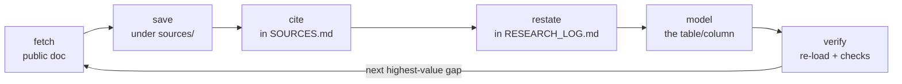

# Reconstruction methodology

How do you rebuild a proprietary system's data model **without touching the
proprietary system**? By treating public documentation as evidence and never
letting the schema get ahead of it. This page is that method — useful both to
audit this project and to apply the same discipline to any other reconstruction.

## The problem

ASYCUDA World (SYDONIA) runs customs in 100+ countries, but its internal database
schema is proprietary and unpublished. The goal was a **faithful, information-
equivalent reference model** for sandbox, analytics, integration and training
use — built entirely from what is public.

## The evidence-first loop

The core discipline: **never write DDL for a table or column until a source for
it is already fetched, cached and cited.** The order is always the same.

Anything introduced by reasoning rather than a document is tagged `-- inferred`
and recorded as inferred in coverage — never quietly promoted to "documented".

## The provenance contract

Two tags, one on every `CREATE TABLE`, and the rule that governs them:

| Tag | Meaning |
|-----|---------|
| `-- src: <ID>` | Grounded in the cited source(s) `<ID>` (each resolves in [Sources](sources.md)) |
| `-- inferred` | Introduced by modelling judgement; no public source at this granularity |

!!! quote "The governing principle"
    A larger honest **inferred** set beats a fabricated **documented** one. If
    something can't be sourced from a document actually fetched, it is tagged
    `-- inferred` and marked in coverage — not given an invented citation.

## Source policy — non-negotiable

**Used freely (public):**

- Official ASYCUDA / UNCTAD programme material and the **official
  technical table descriptions** (the real physical schema, published as
  reference documentation).
- Full ASYCUDA World user and broker manuals published by national customs
  administrations (declaration processing, manifest/cargo, valuation, suspense).
- Open standards: the **WCO Data Model**, the **SAD**, ISO 3166 / 4217 / 6346,
  UN/LOCODE, UN/ECE Rec 21, the Harmonized System, Incoterms.

**Never (out of scope, by rule):**

- Downloading, cracking or decompiling the ASYCUDA software to dump its schema.
- Probing, scanning or logging into any live customs deployment beyond its
  openly published docs.
- Using leaked credentials or bypassing access controls.
- Reproducing long verbatim copyrighted text — structure and field semantics are
  restated in the project's own words; only short field labels are quoted, cited.

The public corpus proved more than sufficient.

## Verification gates "done"

The project is only "done" when these hold **and the checks were re-run** — not
asserted:

1. **Schema loads clean.** `asycuda.sql` → `seed_reference.sql` → `e2e.sql`
   against a fresh PostgreSQL database completes with **zero errors**, and the
   end-to-end example inserts with referential integrity intact.
2. **Every table is grounded.** Every `CREATE TABLE` carries a `-- src:` (ID in
   `SOURCES.md`) or `-- inferred`. Zero untagged.
3. **Every source is cited and cached.** Each cited ID has a row in `SOURCES.md`
   *and* a saved local copy under `sources/`.
4. **Supporting docs match the schema.** Data dictionary, ERD, coverage and the
   research log are complete and consistent with the loaded model.

These map directly to the [`customs-validate`](../skills/index.md) skill.

## How the model was actually built

<b>7</b>research phases

<b>100%</b>sources fetched &amp; cached

<b>55</b>tables, 100% tagged

1. **Orient** — a SAD overview, a WCO Data Model briefing, and a cargo-manifest
   XML message description; confirmed the general + item segment model.
2. **Mine national manuals** — the highest-yield public source: full declaration
   and manifest user guides, from which field names, code lists, segments and
   lifecycles were extracted and restated.
3. **Code tables & standards** — grounded the `ref_*` tables in the ISO/UN/WCO
   standards the forms reference.
4. **Draft the schema** module by module, loading into a scratch DB after each.
5. **Seed & validate** — representative reference data and the end-to-end example.
6. **Document & finalise** — data dictionary, ERD, coverage, fit/gap.
7. **Integrate official data** — later, the **official table
   descriptions** were cited across the schema, upgrading 11 tables from
   `inferred` to documented (49 / 6).

The full trail lives in `RESEARCH_LOG.md` (append-only findings with source IDs)
and `STATE/progress.md`.

## Why the shape differs from the official schema

The official model is a **wide, denormalised** physical schema tuned for the
ASYCUDA engine; this is a **normalised relational** reference model tuned for
sandboxes and analytics. They are information-equivalent for the modelled scope —
the [fit & gap analysis](fit.md) maps every official table to ours and states the
deliberate differences (FK vs inline code+name, surrogate keys, derived totals).
