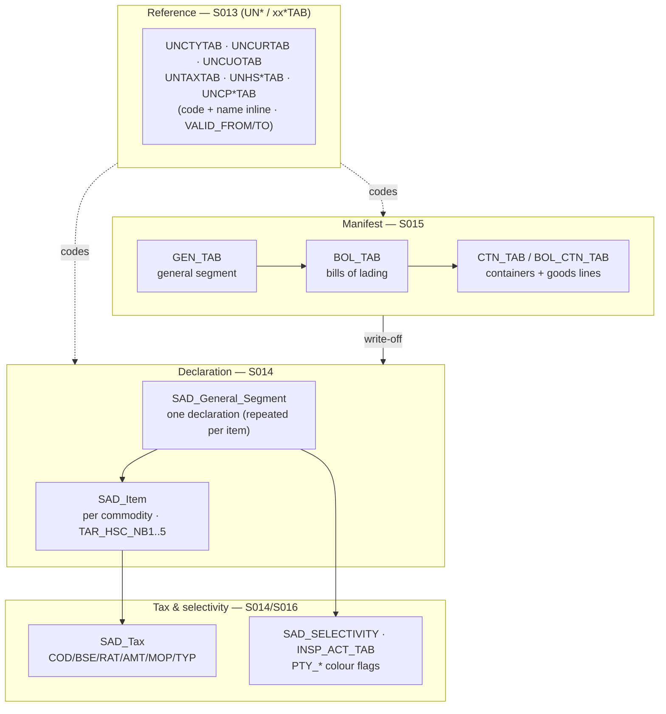

# Querying Sydonia

ASYCUDA World — **Sydonia** in its French-speaking installs — does not keep a
tidy relational model under the hood. Its physical database is **wide,
denormalised, and optimised for the Java engine**, not for the analyst. The
general segment is copied into every item row, HS codes are shattered across five
columns, code and name live side by side with no foreign key, and every reference
table carries a validity window. UNCTAD **does not publish the physical schema**,
so most of what follows is reconstructed from the public layer — the official
Tables Description documents (**S013 reference, S014 declaration, S015 manifest,
S016 accounting**) and the XML wire format.

This section is the part of the toolbox about **querying the real thing**. It
walks the real table families you would hit against a live Sydonia RDBMS, names
the columns that *are* publicly pinned, and is honest about the ones that are not.

!!! warning "The must-request gap — exact physical names are instance-specific"
    A handful of column and table names **are** public and appear verbatim below,
    because they show up in the [Tables Description](../platform/asycuda-world.md)
    and the [XML messages](../platform/xml-messages.md): the `SAD_Tax`
    `COD`/`BSE`/`RAT`/`AMT`/`MOP`/`TYP` roots, the HS split `TAR_HSC_NB1..5`, the
    `PTY_RED`/`YEL`/`GRE`/`BLU` colour flags, `VIT_CIF`/`VIT_STV`, the `INSTANCE_ID`
    engine key, and `VALID_FROM`/`VALID_TO`. **Everything else is the shape, not
    the exact spelling.** The remaining column names on these pages follow AW's
    prefix conventions and match the toolbox's [mock database](https://github.com/FrancoisChastel/sydonia-toolkit/blob/master/Sydonia/adapters/mock_asycuda_world.sql)
    — treat them as *plausible defaults you must confirm against your instance*,
    not as guaranteed identifiers. When you get real access, the physical names
    are the first thing to request.

## Two ways to query

-   :material-database-search:{ .lg .middle } &nbsp;**Directly, against the real tables**

    ---

    Write SQL against `SAD_General_Segment`, `SAD_Item`, `SAD_Tax`, `GEN_TAB`,
    `BOL_TAB`, the `UN*` reference tables — and handle the denormalisation
    yourself. This section documents those tables so you can.

    [:octicons-arrow-right-24: Declaration tables](declaration-tables.md)

-   :material-wand:{ .lg .middle } &nbsp;**Via the logical model + compiler**

    ---

    Write friendly SQL against the toolbox's clean logical names; the **query
    compiler** rewrites it into genuine Sydonia SQL — dedup, HS concat, validity
    filtering and all — so you never touch the gotchas by hand.

    [:octicons-arrow-right-24: The query compiler](../compiler/index.md)

Both hit the same real database. Direct SQL gives you full control and nothing
between you and the engine; the compiler trades that for correctness-by-default on
the five things that reliably bite (see [joins & gotchas](joins-and-gotchas.md)).

## The real table families

The physical schema falls into four layers. Reference tables sit underneath
everything (codes + validity); manifests describe cargo that arrives; declarations
clear it; tax and selectivity hang off each declaration.

## The four sub-pages

-   :material-file-document-outline:{ .lg .middle } &nbsp;**Declaration tables**

    ---

    `SAD_General_Segment`, `SAD_Item`, `SAD_Tax` — the SAD spine, the HS split,
    the valuation build-up and the tax roots, with real-SQL examples.

    [:octicons-arrow-right-24: Declaration tables](declaration-tables.md)

-   :material-ferry:{ .lg .middle } &nbsp;**Manifest tables**

    ---

    `GEN_TAB`, `BOL_TAB`, `CTN_TAB` / `BOL_CTN_TAB` — the cargo manifest, its
    bills of lading and containers, master ⇄ house.

    [:octicons-arrow-right-24: Manifest tables](manifest-tables.md)

-   :material-table-key:{ .lg .middle } &nbsp;**Reference tables**

    ---

    The `UN*` / `xx*TAB` code catalogue — code + name inline (no FK) and the
    `VALID_FROM`/`VALID_TO` temporal-validity pattern.

    [:octicons-arrow-right-24: Reference tables](reference-tables.md)

-   :material-alert-octagon-outline:{ .lg .middle } &nbsp;**Joins & gotchas**

    ---

    The five things that bite — `INSTANCE_ID`, repeated general segment, HS split,
    code+name inline, validity windows — each with symptom and fix.

    [:octicons-arrow-right-24: Joins & gotchas](joins-and-gotchas.md)

## Related

- [ASYCUDA World — the modeled version](../platform/asycuda-world.md) — what the
  real platform is and where the public/private line falls.
- [XML messages & the wire format](../platform/xml-messages.md) — the other public
  window onto the field-level model.
- [How faithful is the reconstruction?](../provenance/fit.md) — the table-by-table
  official-vs-toolbox fit, the source of every real name here.
- [Useful queries](../guides/useful-queries.md) — worked queries against the clean
  logical model.
