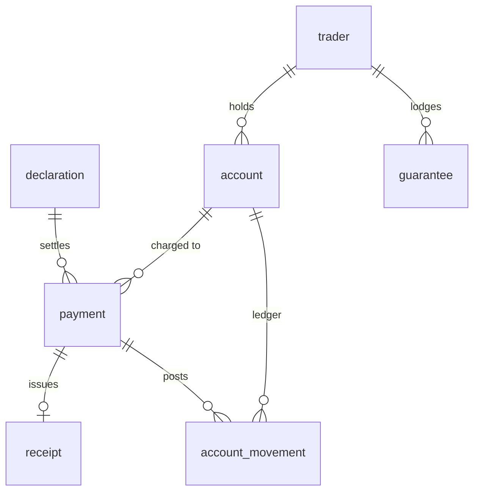

# Accounting

<span class="prov prov--documented">documented</span> — grounded in the official
accounting tables (S016: receipts, `TAX_TAB`, account transactions in/out) and
S003 boxes 48/B.

Once a declaration is assessed, the declarant **pays**, a **receipt** is issued,
and the money is recorded against an **account** ledger. *(GOAL §4.4.)*

## Tables

| Table | Purpose |
|-------|---------|
| `account` | Trader deferred-payment / credit / prepayment / guarantee account (box 48) |
| `payment` | Settlement of an assessed declaration — cash or against an account (box B) |
| `receipt` | The receipt issued on payment |
| `account_movement` | Ledger debit/credit against an account, with running balance |
| `guarantee` | Security / bond backing suspense regimes (box 52) |



Payment mode is flexible: a `NULL` `account_id` on `payment` means **cash**;
otherwise it draws on the trader's `account`, and an `account_movement` records
the debit and the resulting balance.

## Example — assessed vs paid reconciliation

```sql
SET search_path TO asycuda, public;

SELECT d.registration_number,
       assessed.total_tax,
       p.amount        AS paid,
       r.receipt_number
FROM declaration d
JOIN LATERAL (
    SELECT sum(tl.tax_amount) AS total_tax
    FROM declaration_item di
    JOIN declaration_tax_line tl ON tl.declaration_item_id = di.id
    WHERE di.declaration_id = d.id
) assessed ON true
LEFT JOIN payment p ON p.declaration_id = d.id
LEFT JOIN receipt r ON r.payment_id = p.id
WHERE d.trader_reference = 'REF-2026-0001';
```

A healthy declaration has `total_tax = paid = receipt.total_amount`. Full columns
in the [data dictionary](data-dictionary.md#module-accounting-goal-44).
