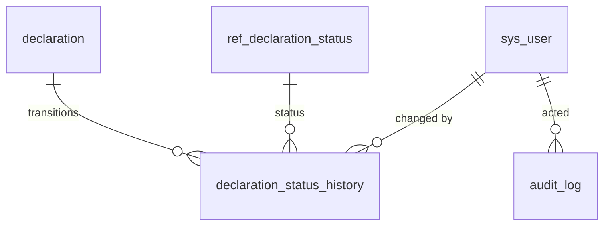

# Audit & workflow

<span class="prov prov--documented">documented</span> (audit log · S013 `LogTable`)
<span class="prov prov--inferred">history shape inferred</span>

Cross-cutting bookkeeping: **who did what, when**, and how each document moved
through its lifecycle. *(GOAL §4.7.)*

## The audit log

`audit_log` is a single, generic who/what/when trail. Rather than a foreign key
per entity, it stores the affected entity by name and surrogate id, so any table
can be audited uniformly:

| Column | Meaning |
|--------|---------|
| `entity_name` | Table / document type affected (e.g. `declaration`) |
| `entity_id` | Surrogate id of the affected row |
| `action` | `insert` / `update` / `status_change` / `print` … |
| `actor_id` | The `sys_user` responsible |
| `occurred_at` | Timestamp (`timestamptz`, defaults to `now()`) |
| `detail` | Free-text description |

## The status-history pattern

Lifecycles are modelled consistently across the schema: a `ref_*_status` catalogue
plus a `*_status_history` child that records each transition. Two instances exist:

| History table | Tracks | Status catalogue |
|---------------|--------|------------------|
| `declaration_status_history` | stored → registered → assessed → paid → released | `ref_declaration_status` |
| `manifest_status_history` | stored → registered → amended → closed | `ref_manifest_status` |



This keeps the **current** status on the parent (`declaration.status_id`) for
fast filtering while preserving the **full trail** in the history child.

## Example — the lifecycle trail of a declaration

```sql
SET search_path TO asycuda, public;

SELECT st.sort_order,
       st.code,
       h.changed_at,
       u.login_name AS changed_by,
       h.note
FROM declaration_status_history h
JOIN ref_declaration_status st ON st.id = h.status_id
LEFT JOIN sys_user u           ON u.id = h.changed_by
JOIN declaration d             ON d.id = h.declaration_id
WHERE d.trader_reference = 'REF-2026-0001'
ORDER BY h.changed_at;
```

Full columns in the [data dictionary](data-dictionary.md#module-audit-workflow-cross-cutting-goal-47).
