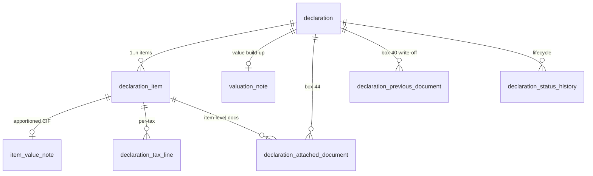

# Declaration — the SAD

<span class="prov prov--documented">documented</span> — the **Single
Administrative Document**, grounded box-by-box in S003 (FSM declaration guide),
S001 (SAD overview) and the official `SAD_General_Segment` / `SAD_Item` /
`SAD_Tax` descriptions (S014).

The core of the model. The **SAD** is the internationally standardised customs
declaration — one **general segment** per consignment plus repeating **item
segments**, one per commodity line. *(GOAL §4.3.)*

## Tables

| Table | Purpose |
|-------|---------|
| `declaration` | General segment — parties, regime, transport, invoice totals, status, lane |
| `declaration_item` | Item segment — HS code, origin, mass, procedure, values (the tax base) |
| `valuation_note` | Declaration-level value build-up → total CIF |
| `item_value_note` | Freight/insurance apportioned per item → item CIF |
| `declaration_tax_line` | Per item, per tax: base · rate · amount · mode of payment |
| `declaration_attached_document` | Invoice, licence, permit, certificate (box 44) |
| `declaration_previous_document` | Write-off against a manifest B/L or prior declaration (box 40) |
| `declaration_status_history` | Lifecycle transitions (stored → … → released) |



## The general segment — `declaration`

One row per consignment. Selected columns (see the
[data dictionary](data-dictionary.md#module-declaration-the-sad-goal-43) for all):

| Column | SAD box | Meaning |
|--------|:------:|---------|
| `office_id` | 29 | Office of entry |
| `declaration_type_id` | 1 | Model/type (IM4, EX1…) |
| `cpc_id` | 37 | Customs Procedure Code / regime |
| `registration_serial`, `registration_number`, `registration_date` | A | Registration identity |
| `exporter_id`, `consignee_id`, `declarant_id`, `financial_id` | 2/8/14/9 | Parties |
| `country_export_id`, `country_origin_id`, `country_destination_id` | 15/34/17 | Countries |
| `incoterm_id`, `delivery_place` | 20 | Delivery terms |
| `total_invoice_amount`, `currency_id`, `exchange_rate` | 22/23 | Invoice value |
| `total_freight`, `total_insurance`, `total_cif_value` | — | Value totals |
| `selectivity_lane_id` | — | Assigned lane (GREEN/YELLOW/RED/BLUE) |
| `status_id` | — | Current lifecycle status |
| `manifest_id` | — | Links to the arriving manifest |

## The item segment — `declaration_item`

One row per commodity line (SAD boxes 31–49). The **customs value** on each item
is the tax base:

| Column | SAD box | Meaning |
|--------|:------:|---------|
| `item_number` | 32 | Line number |
| `hs_id`, `hs_code` | 33 | Commodity code |
| `country_origin_id` | 34 | Origin |
| `cpc_id`, `national_procedure` | 37 | Procedure |
| `number_of_packages`, `package_type_id`, `marks_and_numbers` | 31 | Packaging |
| `gross_mass`, `net_mass` | 35/38 | Mass |
| `supplementary_qty`, `supplementary_uom_id` | 41 | Statistical quantity |
| `item_price`, `valuation_method_code` | 42/43 | Price & method |
| `statistical_value`, `customs_value` | 46/— | **The tax base** (CIF) |

## Valuation — building the tax base

Invoices are usually **FOB** (goods only), but duty is charged on **CIF**. The
valuation note builds the value up, then apportions shared freight/insurance down
to each item by value share:

```text
valuation_note :  invoice FOB + freight + insurance + other = total CIF
item_value_note:  item FOB + apportioned freight + apportioned insurance = item CIF
```

In the worked example, $3,000 freight + $300 insurance on a $60,000 FOB shipment
split 2:1, giving item CIFs of **$42,200** and **$21,100**.

## Taxes — `declaration_tax_line`

One row per item, per applicable tax. Because taxes cascade (VAT is charged on
*customs value + import duty*), the base is stored per line rather than derived:

| Column | `SAD_Tax` | Meaning |
|--------|:---------:|---------|
| `tax_type_id` | `COD` | Which tax (import duty, VAT, excise, fee) |
| `tax_base` | `BSE` | Amount the rate applies to |
| `rate_percent` | `RAT` | Ad-valorem rate |
| `specific_amount` | — | Specific (per-unit) component |
| `tax_amount` | `AMT` | Calculated amount |
| `mode_of_payment` | `MOP` | Cash / account / … |
| `is_manual` | `TYP` | Manually entered vs automatically calculated |

## Documents

- `declaration_attached_document` — supporting documents at header **or** item
  level (invoice `380`, bill of lading `705`, licence `911`…), SAD box 44.
- `declaration_previous_document` — SAD box 40: writes each item off against the
  **manifest bill of lading** (`bl_id`) or a **previous declaration**
  (`prev_declaration_id`), with packages/mass written off.

## Example — assemble a declaration

```sql
SET search_path TO asycuda, public;

SELECT di.item_number,
       di.hs_code,
       di.customs_value,
       sum(tl.tax_amount) AS taxes
FROM declaration d
JOIN declaration_item     di ON di.declaration_id = d.id
LEFT JOIN declaration_tax_line tl ON tl.declaration_item_id = di.id
WHERE d.trader_reference = 'REF-2026-0001'
GROUP BY di.item_number, di.hs_code, di.customs_value
ORDER BY di.item_number;
```

See the [worked example](../guides/worked-example.md) for the full flow, and the
[querying guide](../guides/querying.md) for more join paths.
