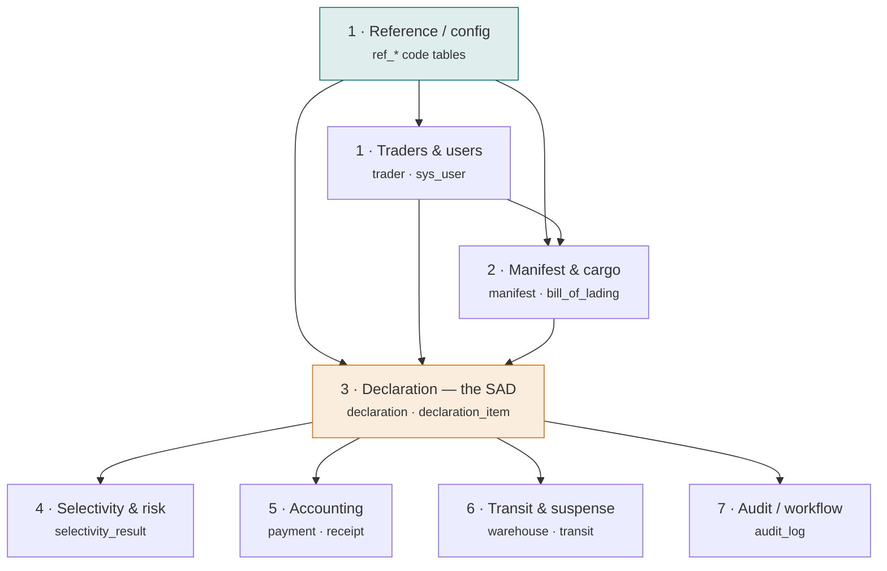

# Schema overview

One file, `Sydonia/schema/asycuda.sql`, defines **55 tables** across **8
modules** and loads top-to-bottom into a dedicated `asycuda` schema. This page
is the map; each module has its own page, and every column is defined in the
[data dictionary](data-dictionary.md).

The modeled system is **ASYCUDA World (v4)**, grounded in the official
UNCTAD/DTL Tables Description documents — see
[the platform](../platform/index.md) for the version lineage and
[ASYCUDA World in depth](../platform/asycuda-world.md) for how this normalised
model relates to the real (unpublished) physical schema.

## Provenance at a glance

Every `CREATE TABLE` is tagged. A table is either grounded in a cited public
source or honestly marked as a modelling inference — never left ambiguous.

documented · 49
&nbsp;grounded in a cited source (`-- src: <ID>`)

inferred · 6
&nbsp;introduced by modelling judgement (`-- inferred`)

The six inferred tables are the RBAC set (`sys_role`, `sys_permission`,
`sys_user_role`, `sys_role_permission`) and the `trader_role` junction — see
[Coverage](../provenance/coverage.md).

## The eight modules

| # | Module | Tables | What it captures |
|---|--------|:------:|------------------|
| 1 | [Reference & configuration](reference-config.md) | 26 | Code tables (countries, currencies, HS, taxes, offices…) + traders & users |
| 2 | [Manifest & cargo](manifest.md) | 5 | Carrier manifest, bills of lading, containers, cargo lines |
| 3 | [Declaration (the SAD)](declaration.md) | 9 | The declaration general + item segments, valuation, taxes, documents |
| 4 | [Selectivity & risk](selectivity.md) | 3 | Risk criteria, lane assignment, inspection acts |
| 5 | [Accounting](accounting.md) | 5 | Accounts, payments, receipts, ledger movements, guarantees |
| 6 | [Transit & suspense](transit-suspense.md) | 5 | Warehousing, transit, temporary admission, warehouses |
| 7 | [Audit & workflow](audit.md) | 2 | Cross-cutting audit log and status-history pattern |

*(Module 1 is split into a reference-tables group and a small traders/users group
on the same page; counts sum to 55.)*

## Conventions

The model follows a small, consistent set of rules — the same ones you should
keep when [extending it](../guides/extending.md):

| Rule | Choice |
|------|--------|
| Namespace | everything in schema `asycuda` |
| Naming | `snake_case`; `ref_` for code tables, `sys_` for system/RBAC |
| Primary keys | surrogate `bigint GENERATED ALWAYS AS IDENTITY` |
| Business keys | real codes (HS, office, TIN, receipt no.) kept `UNIQUE NOT NULL` |
| Coded columns | a foreign key to a `ref_*` table (not an inline code+name pair) |
| Money | `numeric(18,4)` |
| Mass / quantity | `numeric(18,3)` |
| Status lifecycles | a `ref_*_status` table + a `*_status_history` child |
| Provenance | `-- src: <ID>` or `-- inferred` on every `CREATE TABLE` |

## See the whole shape

- **[Entity-relationship diagram](erd.md)** — every foreign key, rendered from
  the loaded schema.
- **[Data dictionary](data-dictionary.md)** — every table and column with type,
  nullability and source.
