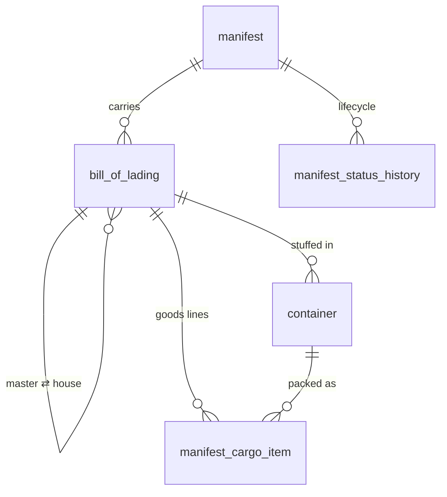

# Manifest & cargo

<span class="prov prov--documented">documented</span> — grounded in the official
UNCTAD manifest XML spec (S008) and national manifest manuals (S006, S007, S010,
S011) and the official `GEN_TAB` / `BOL_TAB` / `CTN_TAB` descriptions (S015).

What the **carrier** declares is on board. This is the upstream document the
importer's declaration later writes off against. *(GOAL §4.2.)*

## Tables

| Table | Purpose |
|-------|---------|
| `manifest` | General segment: carrier, voyage/flight, ports, dates, totals, office |
| `bill_of_lading` | A transport document (B/L / AWB). Master ⇄ house via self-reference |
| `container` | Physical containers on a B/L — ISO 6346 type, seals, weights, reefer |
| `manifest_cargo_item` | Goods/commodity lines within a B/L |
| `manifest_status_history` | Manifest lifecycle transitions |



## Master vs house — degroupage

A **master** bill of lading covers a full container moving carrier-to-carrier; a
**house** bill of lading is one consignee's consignment inside it. Consolidation
(**degroupage**) is modelled with a self-reference:

```sql
-- a house B/L points at its master
bill_of_lading.master_bl_id  →  bill_of_lading.id
bill_of_lading.is_master     boolean
```

## Key columns — `manifest`

| Column | Type | Meaning |
|--------|------|---------|
| `office_id` | FK | Customs office of arrival |
| `manifest_year`, `registration_number` | int | Registration serial |
| `voyage_number`, `identity_of_transport` | text | Voyage / vessel identity |
| `transport_mode_id`, `nationality_id` | FK | Mode + carrier nationality |
| `carrier_id`, `shipping_agent_id` | FK → `trader` | Parties |
| `place_departure_id`, `place_destination_id` | FK → `ref_location` | Ports |
| `date_of_departure`, `date_of_arrival` | date | Voyage dates |
| `total_bols`, `total_packages`, `total_containers`, `total_gross_mass` | num | Declared totals |
| `status_id` | FK | Current lifecycle status |

## Example — a manifest with its consignments

```sql
SET search_path TO asycuda, public;

SELECT m.voyage_number,
       bl.bl_reference,
       nat.name AS bl_nature,
       bl.number_of_packages,
       bl.gross_mass,
       count(ci.id) AS goods_lines
FROM manifest m
JOIN bill_of_lading bl      ON bl.manifest_id = m.id
JOIN ref_bl_nature  nat     ON nat.id = bl.bl_nature_id
LEFT JOIN manifest_cargo_item ci ON ci.bl_id = bl.id
WHERE m.voyage_number = 'V2026-042'
GROUP BY m.voyage_number, bl.bl_reference, nat.name,
         bl.number_of_packages, bl.gross_mass;
```

Full columns in the [data dictionary](data-dictionary.md#module-manifest-cargo-goal-42).

!!! info "Known gap"
    The manifest XML also defines a **vehicle sub-segment** (chassis/VIN/engine for
    RoRo cargo). It is documented in the research log but not modelled as a table,
    as it sits off the end-to-end path. Tracked in [Coverage](../provenance/coverage.md).
