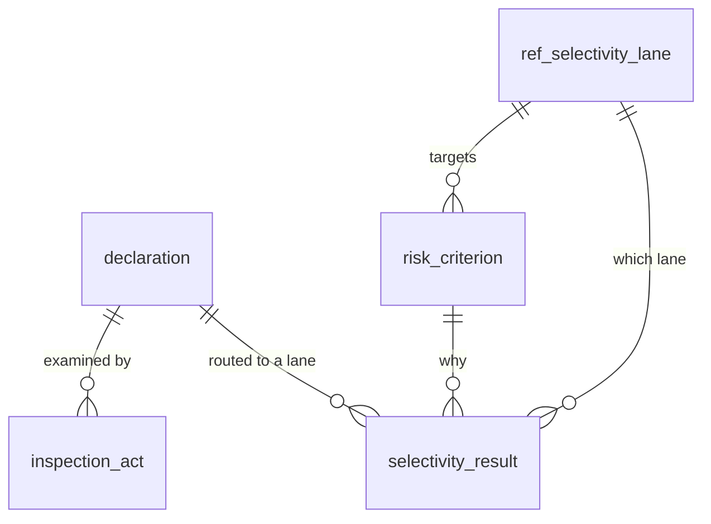

# Selectivity & risk

<span class="prov prov--documented">documented</span> — lanes and inspection
grounded in S002 and S005; the risk-criteria catalogue in the official
`SEL_*_PARAM_TAB` selectivity tables (S014).

Customs cannot inspect every consignment. **Selectivity** routes each declaration
into a risk **lane**, balancing facilitation against control. *(GOAL §4.6.)*

## The four lanes

| Lane | Requires exam | Meaning |
|------|:-------------:|---------|
| :material-circle:{ style="color:#16a34a" } **GREEN** | no | Automatic release; customs reserves the right to examine |
| :material-circle:{ style="color:#ca8a04" } **YELLOW** | yes | Documentary check by an assigned officer |
| :material-circle:{ style="color:#dc2626" } **RED** | yes | Physical examination of the goods |
| :material-circle:{ style="color:#2563eb" } **BLUE** | no | Released now, selected for post-clearance audit |

## Tables

| Table | Purpose |
|-------|---------|
| `ref_selectivity_lane` | The lane catalogue (defined in [Reference & config](reference-config.md)) |
| `risk_criterion` | Rules that target a lane (e.g. high-risk HS chapter, first-time importer) |
| `selectivity_result` | The lane a specific declaration was routed to, when and by which criterion |
| `inspection_act` | The officer's examination record for yellow/red declarations |



The declaration also carries its current lane inline on
`declaration.selectivity_lane_id` for fast filtering, while `selectivity_result`
preserves the full routing history and reason.

## Example — inspection outcomes by lane

```sql
SET search_path TO asycuda, public;

SELECT lane.code AS lane,
       count(*)          AS declarations,
       count(ia.id)      AS inspected,
       count(*) FILTER (WHERE ia.result = 'conform') AS conform
FROM declaration d
JOIN ref_selectivity_lane lane ON lane.id = d.selectivity_lane_id
LEFT JOIN inspection_act ia    ON ia.declaration_id = d.id
GROUP BY lane.code
ORDER BY lane.code;
```

Full columns in the [data dictionary](data-dictionary.md#module-selectivity-risk-goal-46).
