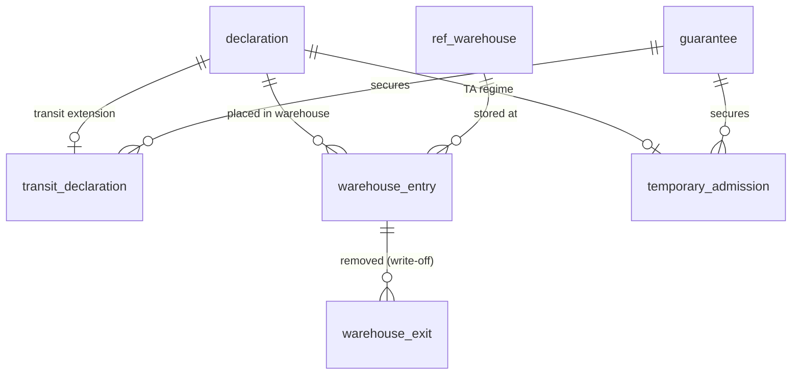

# Transit & suspense

<span class="prov prov--documented">documented</span> — grounded in the
Suspense Declarations manual (S019), the official warehouse/transit tables
(`SUS_WH_IN`, `MAN_TRANSIT_TAB`; S014/S015) and S003 boxes 49–53.

Not all goods are cleared for home use on arrival — duty can be **suspended**
while goods are warehoused, moved under control, or temporarily imported.
*(GOAL §4.5.)*

## The suspense regimes

| Regime | What happens | Tables |
|--------|--------------|--------|
| **Warehousing** | Goods stored in a bonded warehouse until later entry | `ref_warehouse`, `warehouse_entry`, `warehouse_exit` |
| **Transit** | Goods moved under customs control between offices | `transit_declaration` |
| **Temporary admission** | Imported for a limited time, then re-exported | `temporary_admission` |

All three lean on `guarantee` (from [Accounting](accounting.md)) to secure the
suspended duty.



## Key details

- **`transit_declaration`** extends a declaration with the principal (box 50),
  the offices of departure / transit / destination (boxes 51/53), the securing
  `guarantee` (box 52), itinerary, seals and a time limit.
- **`warehouse_entry` / `warehouse_exit`** track goods into and out of a
  `ref_warehouse`; the exit is the ex-warehouse write-off.
- **`temporary_admission`** records the time limit and links to the eventual
  re-export declaration (`re_export_declaration_id`).

## Example — goods currently in a warehouse

```sql
SET search_path TO asycuda, public;

SELECT w.code AS warehouse,
       we.entry_date,
       we.packages,
       we.gross_mass
FROM warehouse_entry we
JOIN ref_warehouse w ON w.id = we.warehouse_id
LEFT JOIN warehouse_exit wx ON wx.warehouse_entry_id = we.id
WHERE wx.id IS NULL          -- not yet removed
ORDER BY we.entry_date;
```

Full columns in the [data dictionary](data-dictionary.md#module-transit-suspense-goal-45).
